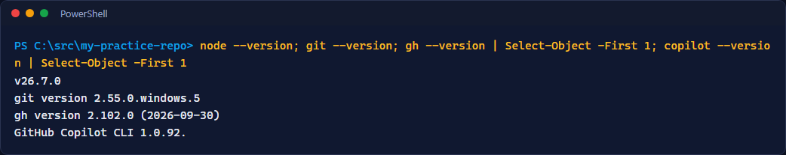
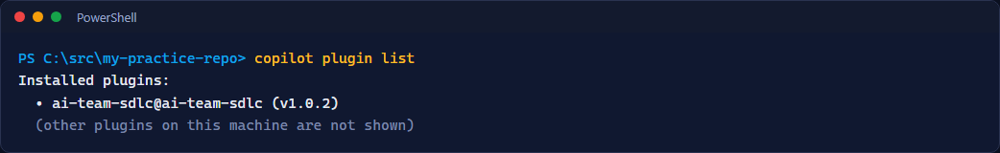
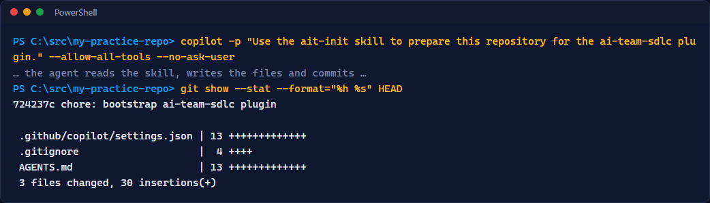

# Lab 0: Prerequisites and setup

<span class="chip phase-prod"><span aria-hidden="true">🧰</span> Setup</span> <span class="chip phase-idea">20 min</span> <span class="chip phase-plan">Beginner</span>

## Overview

<div class="lab-meta" markdown>

| Item | Details |
|------|---------|
| **Duration** | 20 minutes |
| **Level** | Beginner |
| **Platform** | Windows 10 or 11, PowerShell 7 (Windows PowerShell 5.1 also works), VS Code optional |
| **Prerequisites** | A GitHub account with GitHub Copilot access that includes Copilot CLI. Internet access to `github.com` and `registry.npmjs.org`. |
| **Checkpoint** | A practice repository where `copilot plugin list` shows `ai-team-sdlc` and `ait-init` has run. Tag `lab-00-end` in the reference repository once published. |
| **Next lab** | [Lab 1: From idea to brief](lab-01-idea-to-brief.md) |

</div>

You install and verify the toolchain once. Every later lab assumes this lab is done.

## Learning objectives

By the end of this lab, you will be able to:

* Prepare a Windows PowerShell session that shows agent output correctly (UTF-8).
* Install and check Node.js, Git, GitHub CLI and Copilot CLI with `winget`.
* Add the `ai-team-sdlc` marketplace and install the plugin in Copilot CLI.
* Create a practice repository and bootstrap it with the `ait-init` skill.
* Explain the difference between `/product-*` prompts (VS Code) and skills (CLI).
* Estimate the time and credit cost of a lifecycle run before you start one.

## Cost and credits { #cost-and-credits }

!!! cost "A full run is long and uses real credits"
    In the recorded Focus Garden sample, one run through to the sign-off package took about 166 minutes and about 2,097 AI credits. A resume run took 19 minutes and about 392 credits. **A full lifecycle run can use about 2,000 credits or more and 2 to 3 hours.**

    To save cost: follow the recorded runs and jump to the **checkpoints**, keep your app small (3 or 4 features), and run one bounded phase at a time. You can stop a run with `Ctrl+C` and resume it later from its saved state.

## Steps

### Step 1: Use a UTF-8 console

Agent output contains accents and symbols. A default Windows console may display them as garbage (`ΓÇö`). Set UTF-8 in every new session:

```powershell
[Console]::OutputEncoding = [System.Text.Encoding]::UTF8
$OutputEncoding = [System.Text.Encoding]::UTF8
[Console]::OutputEncoding.WebName
```

!!! success "Expected result"
    The last command prints `utf-8`.

!!! tip "Make it permanent"
    Add the first two lines to your PowerShell profile: `notepad $PROFILE` (create the file if it does not exist).

### Step 2: Install and check the tools

Install what is missing. `winget` ships with current Windows 10 and 11 (it is part of *App Installer*).

```powershell
winget install --id OpenJS.NodeJS.LTS -e
winget install --id Git.Git -e
winget install --id GitHub.cli -e
winget install --id GitHub.Copilot -e
```

Close the terminal and open a new one so the new `PATH` is loaded (and set UTF-8 again, step 1). Then check:

```powershell
node --version; git --version; gh --version; copilot --version
```

<figure class="screenshot-frame" markdown>

<figcaption>Checking the four tool versions in PowerShell. Your version numbers can be newer.</figcaption>
</figure>

!!! success "Expected result"
    Four version lines print, with no "not recognized" error. The recorded run used Copilot CLI 1.0.91 and plugin v1.0.2; newer versions are fine.

### Step 3: Sign in to GitHub and Copilot

```powershell
gh auth login
gh auth status
copilot
```

Follow the browser prompts for `gh auth login` (GitHub.com, HTTPS, web browser). In `copilot`, complete the sign-in if it asks (`/login`), then leave with `Ctrl+C` twice or `/exit`.

!!! success "Expected result"
    `gh auth status` reports that you are logged in to `github.com`, and `copilot` opens without an authentication error.

### Step 4: Add the marketplace and install the plugin

```powershell
copilot plugin marketplace add devopsabcs-engineering/ai-team-sdlc
copilot plugin install ai-team-sdlc@ai-team-sdlc
```

!!! success "Expected result"
    Each command ends without an error and confirms the marketplace was added and the plugin installed.

### Step 5: Verify the plugin

```powershell
copilot plugin list
```

<figure class="screenshot-frame" markdown>

<figcaption>The plugin list must include ai-team-sdlc. Other plugins on the capture machine are not shown.</figcaption>
</figure>

!!! success "Expected result"
    The list includes `ai-team-sdlc` (version 1.0.2 at the time of writing).

### Step 6: Create the practice repository

Use a short path, outside OneDrive-synced folders, to avoid file-lock problems.

```powershell
New-Item -ItemType Directory -Force "$HOME\src\ai-sdlc-practice" | Out-Null
Set-Location -LiteralPath "$HOME\src\ai-sdlc-practice"
git init -b main
"# AI-SDLC practice`n" | Set-Content README.md -Encoding utf8
git add README.md
git commit -m "chore: initial commit"
(Get-Location).Path
```

!!! success "Expected result"
    `git log --oneline` shows one commit, and the last command prints the practice folder path.

!!! checkpoint "Recorded path"
    Prefer to start from the reference app? Clone `https://github.com/devopsabcs-engineering/ai-sdlc-labs-pinch` and check out the tag `lab-00-end` once it is published. Your own idea? Keep this practice repository and rename it later.

### Step 7: Bootstrap with ait-init

Always start `copilot` **from the repository root**: the agent's shell tool can ignore `cd` commands, so the folder you start in is the folder it works in.

```powershell
Set-Location -LiteralPath "$HOME\src\ai-sdlc-practice"
copilot -p "Use the ait-init skill to prepare this repository for the ai-team-sdlc plugin." --allow-all-tools --no-ask-user
git status --short
```

<figure class="screenshot-frame" markdown>

<figcaption>Running ait-init from the repository root: three files are added in one commit.</figcaption>
</figure>

!!! success "Expected result"
    The agent reports a result block. `git status --short` lists new files such as `.github/copilot/settings.json`, `AGENTS.md`, `.gitignore` and `.copilot-tracking/.gitkeep`. The tracking folder `.copilot-tracking/` is git-ignored: it holds run state, never source code.

Commit the bootstrap:

```powershell
git add -A
git commit -m "chore: bootstrap repo with the ai-team-sdlc plugin"
```

### Step 8: Run a cheap smoke test

```powershell
copilot -p "Reply with the single word: ready" --no-ask-user
```

!!! success "Expected result"
    The answer is `ready` (or very close to it). The call costs almost nothing and proves that sign-in, network and model access work.

## Prompts and skills in the CLI and in VS Code

The `/product-*` commands are **prompt files for VS Code**. In Copilot CLI you ask for the matching skill in plain words. The labs show both.

| VS Code prompt | Copilot CLI wording |
|----------------|---------------------|
| `/product-run` | `Use the ait-sdlc-orchestrate skill. Specs: ./specs/idea.md ...` |
| `/product-design` | `Use the ait-product-design skill ...` |
| `/product-prototype` | `Use the ait-product-prototype skill ...` |
| `/product-specs` | `Use the ait-tech-specs skill ...` |
| `/product-implement` | `Use the ait-implementation skill ...` |
| `/product-qa` | `Use the ait-qa-validation skill ...` |
| `/product-review` | `Use the ait-review-critic skill ...` |
| `/product-security` | `Use the ait-security skill ...` |
| `/product-deploy` | `Use the ait-deploy skill ...` |

## Validation checklist

Run this from the practice repository root. Every line must say `OK`.

```powershell
$checks = [ordered]@{
  'PowerShell is UTF-8'    = [Console]::OutputEncoding.WebName -eq 'utf-8'
  'node on PATH'           = [bool](Get-Command node -ErrorAction SilentlyContinue)
  'git on PATH'            = [bool](Get-Command git -ErrorAction SilentlyContinue)
  'gh signed in'           = (gh auth status 2>&1 | Out-String) -match 'Logged in'
  'copilot on PATH'        = [bool](Get-Command copilot -ErrorAction SilentlyContinue)
  'plugin installed'       = (copilot plugin list 2>&1 | Out-String) -match 'ai-team-sdlc'
  'plugin enabled in repo' = Test-Path '.github/copilot/settings.json'
  'tracking store ignored' = [bool](Select-String -Path .gitignore -Pattern '.copilot-tracking/' -SimpleMatch -ErrorAction SilentlyContinue)
}
$checks.GetEnumerator() | ForEach-Object { '{0,-24} {1}' -f $_.Key, $(if ($_.Value) { 'OK' } else { 'MISSING' }) }
```

* [ ] The console uses UTF-8.
* [ ] `node`, `git`, `gh` and `copilot` print a version.
* [ ] `gh auth status` shows you are logged in.
* [ ] `copilot plugin list` shows `ai-team-sdlc`.
* [ ] The practice repository contains `.github/copilot/settings.json` and `AGENTS.md`.
* [ ] `.copilot-tracking/` is listed in `.gitignore`.
* [ ] You know roughly what a full run costs and how to stop one.

## Troubleshooting

### npm or the corporate registry fails

Symptoms: `ERR_SSL_SSL/TLS_ALERT_HANDSHAKE_FAILURE`, `E401`, or install steps that hang. The labs need the public registry.

```powershell
npm config get registry
npm config set registry https://registry.npmjs.org/
```

If your network uses a TLS-inspecting proxy, ask your administrator for the proxy and CA settings, or run the labs from a network without inspection. Never commit a lockfile that points to a private feed.

### The agent ignores `cd`

The agent shell can strip a leading `cd`. Start `copilot` from the repository root and use relative paths. In scripts, use `Set-Location -LiteralPath <absolute path>` and print `(Get-Location).Path` to confirm.

### The plugin is not listed

Run `copilot plugin marketplace add devopsabcs-engineering/ai-team-sdlc` again, then `copilot plugin install ai-team-sdlc@ai-team-sdlc`. Check your Copilot CLI version with `copilot --version`; run `copilot update` if it is old. Open a new terminal and retry `copilot plugin list`.

### `/product-run` does nothing in the CLI

Those are VS Code prompts. In the CLI, write `Use the ait-sdlc-orchestrate skill ...`. See the table above.

### `winget` or a command is not recognized

Install or update *App Installer* from the Microsoft Store, then open a **new** terminal. A command that was just installed is not on the `PATH` of an already open window.

More help: [Troubleshooting](../troubleshooting.md).

## Knowledge check

??? question "Why start `copilot` from the repository root?"
    The agent's shell tool can ignore `cd`, so the folder where you start the CLI is the folder it works in. Starting at the root keeps every file operation inside your repository.

??? question "Is `ait-init` required?"
    No. The orchestrator creates the tracking store on its first run. `ait-init` only makes the adoption explicit: it enables the plugin in the repository, adds a short `AGENTS.md` pointer and git-ignores `.copilot-tracking/`.

??? question "Which two choices keep a lab run cheap?"
    Follow the recorded checkpoints instead of re-running everything, and keep the app small with one bounded phase per run.

??? question "What does `--allow-all-tools` change, and why is it risky?"
    It lets the agent run commands and edit files without asking you each time. Use it only in a practice or throwaway repository, never in a folder that holds work you cannot recreate.

## Next steps

You are ready for [Lab 1: From idea to brief](lab-01-idea-to-brief.md), where you write the product brief that every later phase will follow.
