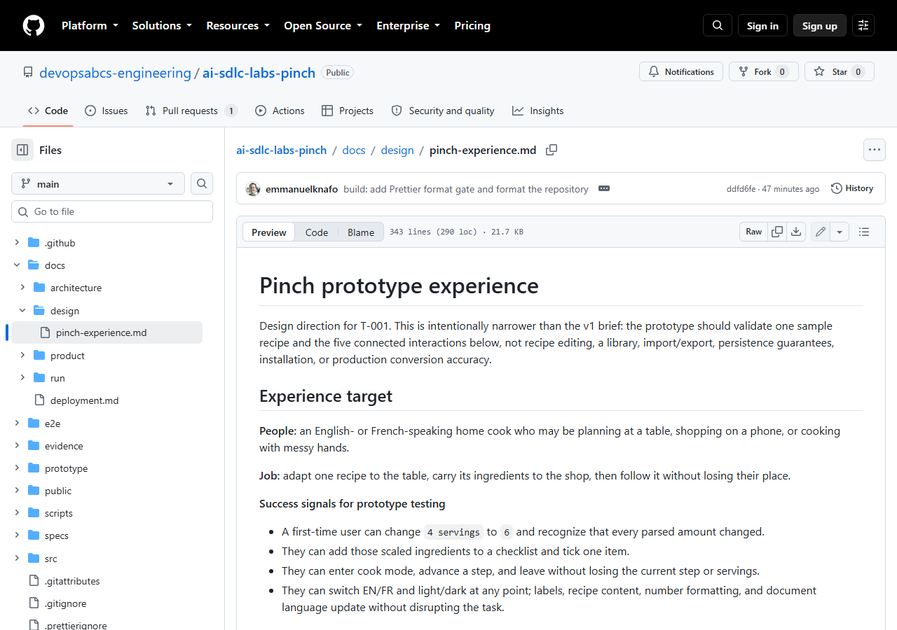
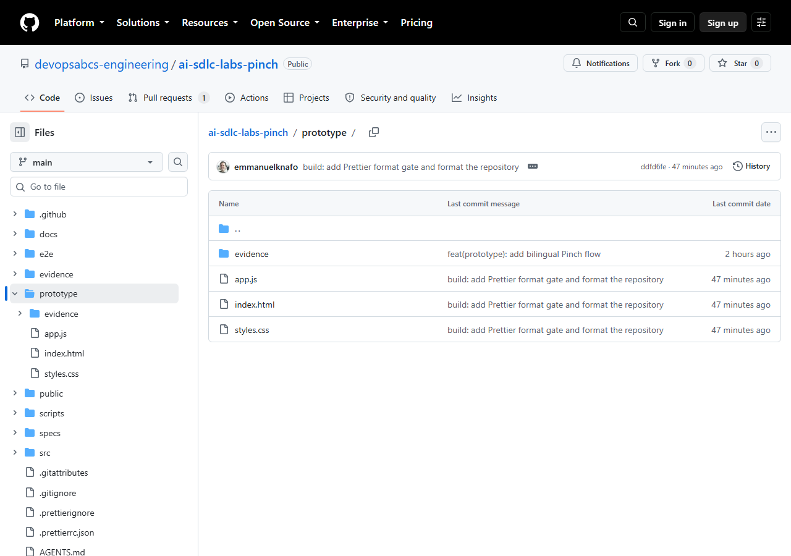

# Lab 2: Design and prototype

<span class="chip phase-plan"><span aria-hidden="true">🧭</span> Plan</span> <span class="chip phase-idea">35 min</span> <span class="chip phase-plan">Beginner</span>

## Overview

<div class="lab-meta" markdown>

| Item | Details |
|------|---------|
| **Duration** | 35 minutes |
| **Level** | Beginner |
| **Prerequisites** | [Lab 1: From idea to brief](lab-01-idea-to-brief.md) |
| **Checkpoint** | Tag `lab-02-end` in the reference repository: design documents and a verified prototype are committed. |
| **Next lab** | [Lab 3: Requirements and architecture](lab-03-requirements-architecture.md) |

</div>

This is the first lab where agents work. You run **one bounded phase**: the product designer turns the brief into journeys, wireframes and design tokens, then a prototype is built and checked in a real browser. The prototype is thrown away later: production code is built in Lab 4. Its job is to find UX problems while they are still cheap.

## Learning objectives

By the end of this lab, you will be able to:

* Run the `ait-product-design` skill and read its journeys, flows and design tokens.
* Run the `ait-product-prototype` skill to get a clickable prototype.
* Verify the prototype in a real browser with Playwright through `ait-prototype-testing`.
* Pass the `design-review` and `prototype-review` gates, and explain what each one checks.

## Cost and credits

!!! cost "About 284 credits for this lab in the recorded run"
    The recorded Lab 2 run used 284.39 credits. The design task took about 3 minutes. The wall time printed at the end (11h12m) is a timer artifact: the real time was roughly 15 to 25 minutes. See [Cost and credits](lab-00-setup.md#cost-and-credits) in Lab 0 for the general guidance.

    To reduce the cost: ask for a static HTML prototype only, one sample item and a bounded phase, as the prompt below does.

## Steps

### Step 1: Start from a clean repository root

Always start `copilot` from the repository root. Make sure the brief is committed and keep run transcripts out of Git. The reference repository does the same: its `lab-01-end` commit is `22d3f4e` ("chore: ignore console transcripts").

```powershell
Set-Location -LiteralPath "$HOME\src\ai-sdlc-practice"
Add-Content .gitignore "evidence/logs/"
git status --short
```

!!! success "Expected result"
    `git status --short` shows at most the `.gitignore` change. `specs/idea.md` is already committed.

### Step 2: Run the design and prototype phase

The recorded run asked the orchestrator for Plan part 1 only: design, then prototype with browser testing. The prompt below follows that run:

```powershell
New-Item -ItemType Directory -Force evidence\logs | Out-Null
copilot -p "Use the ait-sdlc-orchestrate skill. Specs: ./specs/idea.md. Run ONLY the first part of the Plan phase: ait-product-design, then ait-product-prototype with ait-prototype-testing. Build a static HTML prototype only (no web-artifacts-builder), with EN and FR strings and light and dark themes. Commit with Conventional Commits and stop. Do not push, do not deploy." --allow-all-tools --allow-all-paths --allow-all-urls --no-ask-user --share evidence\lab-02-design-prototype.md --log-dir evidence\logs
```

**Interactive alternative.** Run `copilot` from the repository root, then paste the same prompt text. You can answer questions and stop the run with `Ctrl+C`. In VS Code, use the `/product-design` and `/product-prototype` prompts instead.

!!! warning "These flags remove the safety questions"
    `--allow-all-tools --allow-all-paths --allow-all-urls --no-ask-user` let the agent run commands and write files without asking. Use them only in your practice repository, as in Lab 0.

!!! success "Expected result"
    The run ends with a summary and a session id, and the orchestrator reports tasks `T-001` and `T-002`. The tracking folder `.copilot-tracking/<run-id>/` now has `state.json`, `plan.md`, `tasks.md`, `decisions.md` and `changes.md`.

### Step 3: Read the design

Task `T-001`, "Design the Pinch experience", is owned by `ait-product-designer` and must pass the `design-review` gate. Its output is `docs/design/pinch-experience.md` (342 lines in the recorded run, committed as `8fa6d89`, "docs(design): define Pinch prototype experience"). It contains EN and FR journeys, responsive wireframes, interaction states, accessibility requirements, and light and dark tokens.

```powershell
Get-Content docs\design\pinch-experience.md | Select-Object -First 30
Select-String -Path docs\design\pinch-experience.md -Pattern '^## ' | ForEach-Object { $_.Line }
```

<figure class="screenshot-frame" markdown>

<figcaption>The first section of the design document. Look at the success signals: each one is a check that the prototype test can later pass or fail.</figcaption>
</figure>

Read these decisions in the document, because they limit the prototype:

* One bilingual sample recipe, **Crêpes / Crepes**, with four ingredients and three steps.
* A three-step cook mode.
* Wake lock, swipe and motion are progressive enhancements, not required.

The success signals show how a design becomes testable:

```markdown
- A first-time user can change `4 servings` to `6` and recognize that every parsed amount changed.
- They can enter cook mode, advance a step, and leave without losing the current step or servings.
```

The visual direction is named **Measured enamel**, with a semantic token contract such as `--color-action: #165b4a` for the light theme and `#78d6b0` for the dark theme.

### Step 4: Open the prototype and its evidence

Task `T-002`, "Build and verify the prototype", must pass the `prototype-review` gate. It created three files in `prototype/`: `index.html`, `styles.css` and `app.js`, with clickable scaling, unit conversion, a shopping list, cook mode, theme switching and localization. It was committed as `f1e66bb` ("feat(prototype): add bilingual Pinch flow").

```powershell
Start-Process prototype\index.html
Get-ChildItem prototype, prototype\evidence | Select-Object Name, Length
```

Try the flow by hand: change servings from 4 to 6, add the ingredients to the list and tick one, start cooking, press next, switch EN/FR and light/dark.

<figure class="screenshot-frame" markdown>

<figcaption>The prototype folder: three plain files you can open without a build step, and an evidence folder with the browser screenshots. Look for the evidence folder, which is the proof the review gate asks for.</figcaption>
</figure>

!!! success "Expected result"
    The page opens offline in your browser and all five interactions work. `prototype\evidence` contains screenshots; in the recorded run they are `desktop-cook-dark-fr.png` and `mobile-recipe-dark-fr.png`.

!!! tip "A prototype is disposable"
    Do not polish it and do not build on it. Lab 4 builds the real app with Vite and TypeScript from the requirements and architecture of Lab 3.

### Step 5: Check the two gates

Compare what each gate asks for with what you saw:

| Gate | What it checks | Evidence in the recorded run |
|------|----------------|------------------------------|
| `design-review` | The design is complete, state-ready, responsive, accessible, buildable and consistent. | The review notes at the end of `docs/design/pinch-experience.md`. |
| `prototype-review` | The prototype was driven in a real browser: flows, interaction states, console errors, responsive layout. | A headless Chromium test at 1024x768 and 360x800, with reduced motion and zero console errors. |

Check the tracking state and the commits:

```powershell
Get-Content .copilot-tracking\*\tasks.md
git log --oneline -n 5
```

!!! success "Expected result"
    Both tasks are `done`, with their gates passed. Your commit list contains a `docs(design)` commit and a `feat(prototype)` commit. The reference run produced `8fa6d89` and `f1e66bb`.

## Checkpoint

!!! checkpoint "Tag lab-02-end"
    In the reference repository, `lab-02-end` is commit `f1e66bb`. It follows `lab-01-end` (`22d3f4e`).

```powershell
git clone https://github.com/devopsabcs-engineering/ai-sdlc-labs-pinch "$HOME\src\ai-sdlc-labs-pinch"
Set-Location -LiteralPath "$HOME\src\ai-sdlc-labs-pinch"
git diff lab-01-end lab-02-end --stat
git checkout lab-02-end
Start-Process prototype\index.html
```

The diff lists 6 files with 1,242 insertions: the design document, the three prototype files and the two evidence screenshots. Return to the latest state with `git checkout main`.

## Bring your own idea { #bring-your-own-idea }

Run the same flow on your own brief:

* [ ] Your `specs/idea.md` is committed and has 3 or 4 features.
* [ ] Your prompt says "Run ONLY" the design and prototype part and ends with "Do not push, do not deploy".
* [ ] You asked for a static HTML prototype only and no `web-artifacts-builder`.
* [ ] You limited the sample to one item with a few lines of data, in both languages if your app is bilingual.
* [ ] After the run, you check both gates and the `.copilot-tracking/<run-id>/tasks.md` file before moving on.

!!! tip "Cost-saving scope"
    Prototype only the two or three interactions that carry the most risk. The Pinch design deliberately validates one sample recipe and five connected interactions, not the whole v1 scope.

## What went wrong in the recorded run

The first attempt at `T-002` was **blocked**: the Playwright MCP was not available, so the browser-verification gate could not close. The orchestrator did not skip the gate. It found the cached `playwright-core` without installing anything, wrote a headless Chromium test and ran it. One assertion failed (the status announcement for a checked item); the orchestrator fixed it, and the test then passed at 1024x768 and 360x800 with reduced motion and zero console errors.

The lesson is the rule from the shared contract: a gate that cannot run is **blocked**, not skipped.

## Troubleshooting

### T-002 is blocked because the browser test cannot run

Do not waive the gate. Ask the orchestrator to run the test with Playwright's headless Chromium, as in the recorded run. If no browser is installed, `npx playwright install chromium` downloads one from the public registry. Then resume the run.

### The run stopped or the terminal closed

State is saved in `.copilot-tracking/<run-id>/state.json`. Resume with `copilot --resume=<session-id>` (the id is printed at the end of each run), or start `copilot` again and ask the orchestrator to resume the run id. Finished tasks are not redone, and a task left `in_progress` is run again.

### My prototype looks different from the screenshots

That is normal. Models vary, and the Measured enamel direction is the choice of this run. Judge your result with the gates and with the success signals in your own design document, not by pixels.

### The run used more credits than expected

Check that the prompt says "Run ONLY" the first part of the Plan phase. A prompt that asks for the whole lifecycle starts later phases. Stop with `Ctrl+C`, then resume with a bounded prompt.

## Knowledge check

??? question "What is the difference between `design-review` and `prototype-review`?"
    `design-review` checks the design document: complete journeys, states, responsive wireframes, accessibility and consistency. `prototype-review` checks the running prototype, driven in a real browser.

??? question "A gate cannot run. Can the agent mark it as skipped?"
    No. A required gate that cannot run blocks the task. Only a human waiver recorded in `decisions.md` can change that.

??? question "Why not keep the prototype as the first version of the app?"
    It is a spike made of plain files to test the experience. The real app is built in slices in Lab 4, from the requirements and architecture produced in Lab 3.

## Summary

You ran the design and prototype phase in one bounded run, read the design document, tried the clickable prototype and checked the two gates. You saw that the browser gate was blocked first, and that the agent closed it with a real headless test instead of skipping it.

## Next steps

Continue with [Lab 3: Requirements and architecture](lab-03-requirements-architecture.md), where the design becomes a PRD, architecture decisions and a backlog of build slices.
