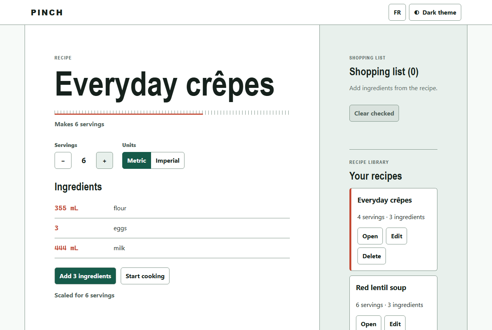
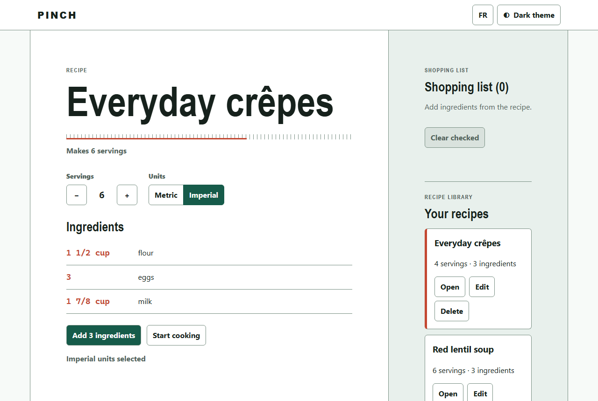
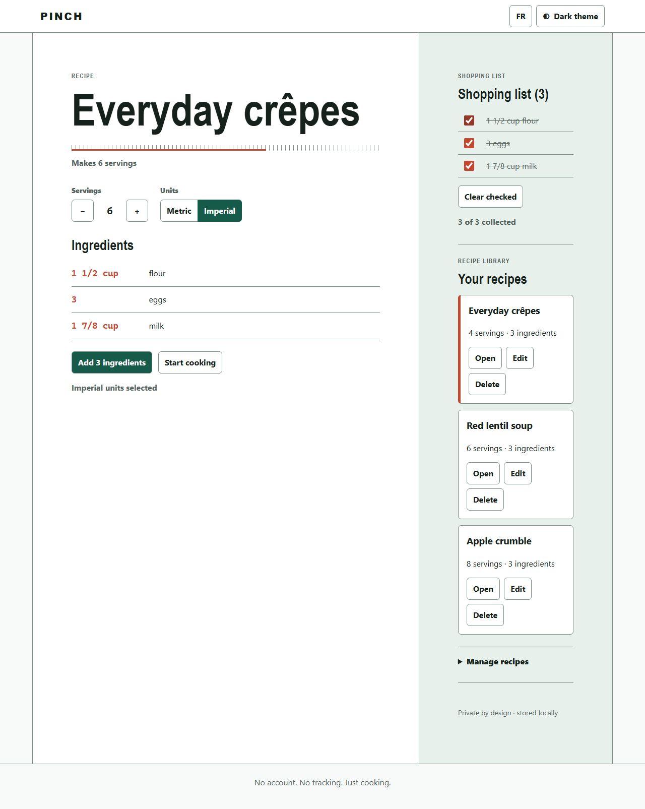
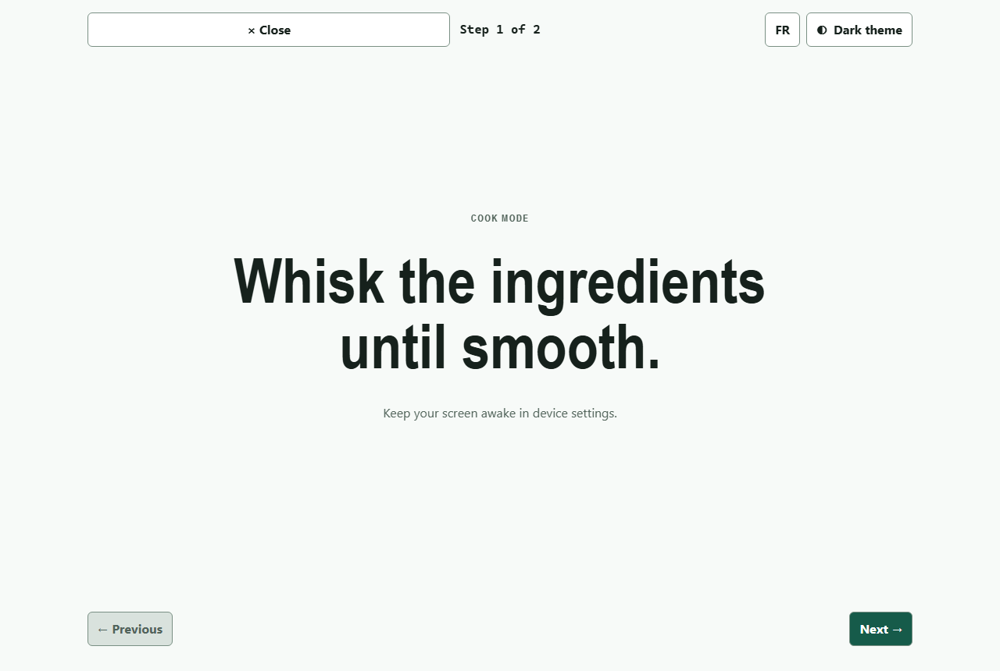

# Lab 4: Build in slices

<span class="chip phase-build"><span aria-hidden="true">🔨</span> Build</span> <span class="chip phase-idea">60 min</span> <span class="chip phase-build">Intermediate</span>

## Overview

<div class="lab-meta" markdown>

| Item | Details |
|------|---------|
| **Duration** | 60 minutes |
| **Level** | Intermediate |
| **Prerequisites** | [Lab 3: Requirements and architecture](lab-03-requirements-architecture.md) |
| **Checkpoint** | Tag `lab-04-end` in the reference repository: all build tasks are done, every build gate has passed, one commit per task. |
| **Next lab** | [Lab 5: QA, critic review and security](lab-05-qa-critic-security.md) |

</div>

This is where code appears. You run two bounded build phases. The orchestrator builds seven slices, checks each one with the gates from Lab 3 and commits each one separately.

## Learning objectives

By the end of this lab, you will be able to:

* Read how the orchestrator decomposes the spec into atomic tasks in `state.json` and `tasks.md`.
* Run a bounded build phase and stop it at a gate.
* Explain the `build`, `lint` and `unit` gates and the project gates `i18n-parity` and `portable-os`.
* Follow the inbox and the Scribe: how agents report without editing shared files.
* Commit once per task so a bad task is easy to roll back.

## Cost and credits { #cost-and-credits }

!!! cost "The most expensive lab so far: about 763 credits and 48 minutes"
    The recorded build used two bounded runs:

    | Run | Tasks | Credits | Time |
    |-----|-------|---------|------|
    | `lab-04a-build-slices-1` | T-004 to T-007 | 394.17 | 28 min 39 s |
    | `lab-04b-build-slices-2` | T-008 to T-010 | 368.57 | 19 min 23 s |

    **Total: about 763 credits and 48 minutes of agent time.** You can stop at the end of any slice with `Ctrl+C` and resume later. To save credits, follow the recorded commits and jump to the [checkpoint](#checkpoint). See [Lab 0](lab-00-setup.md#cost-and-credits) for the cost picture.

## Steps

### Step 1: Check the starting point

You need the specification from Lab 3 and Node.js from Lab 0.

```powershell
git status --short
node --version
$s = Get-Content .copilot-tracking\<run-id>\state.json -Raw | ConvertFrom-Json
$s.tasks | Where-Object { $_.id -match '^T-0(0[4-9]|10)$' } | Select-Object id, title, status
```

Replace `<run-id>` with your run folder (the recorded run used `2026-10-05-pinch`).

!!! success "Expected result"
    The working tree is clean and tasks T-004 to T-010 are `pending`. The brief requires every script to run on Linux and Windows, so use a current Node.js LTS.

### Step 2: Build the first four slices

Run one bounded phase. The prompt tells the orchestrator what to do per task and where to stop.

```powershell
copilot -p "Use the ait-sdlc-orchestrate skill and resume the run. Run ONLY the build tasks T-004, T-005, T-006 and T-007, one at a time, in dependency order. For each task: dispatch ait-frontend-dev, then re-run the task's requiredGates yourself, record the result in state.json, archive the inbox handoff, and make one Conventional Commit. Stop after T-007. Do not push, do not deploy." --allow-all-tools --allow-all-paths --allow-all-urls --no-ask-user --share evidence\lab-04a-build-slices-1.md --log-dir evidence\logs
```

You can also run `copilot` interactively and paste the same prompt. In VS Code, the matching prompt is `/product-implement`.

!!! warning "Let it finish a slice"
    If you interrupt in the middle of a task, `state.json` keeps it as `in_progress`. On resume the orchestrator treats it as not done and runs it again. That is safe, but you pay for the slice twice.

!!! success "Expected result"
    The run ends with four commits: `feat: scaffold bilingual app shell`, `feat: add quantity scaling and conversion`, `feat: add local recipe data management` and `feat: build responsive recipe scaler`.

### Step 3: Read what one slice looks like

Every slice follows the same seven moves. This is the orchestrator's job; the developer agent only writes code.

1. Pick the first task that is `pending` and whose dependencies are `done`.
2. Mark it `in_progress` in `state.json` and dispatch `ait-frontend-dev` with the task, its acceptance criteria and its required gates.
3. The developer writes code and tests, then returns a result block and writes **one** inbox file. It never edits `plan.md`, `tasks.md` or `state.json`.
4. The orchestrator **re-runs the required gates itself**. It does not trust the developer's report.
5. It records each gate result in `state.json` (`gateResults`) and marks the task `done` only if every required gate is `passed`.
6. It archives the inbox handoff into `inbox\processed\` and updates `changes.md`.
7. It makes **one** Conventional Commit.

Look at the evidence after the run:

```powershell
git log --oneline -8
Get-ChildItem .copilot-tracking\<run-id>\inbox\processed | Select-Object -Last 4 Name
$s = Get-Content .copilot-tracking\<run-id>\state.json -Raw | ConvertFrom-Json
$s.tasks | Where-Object { $_.id -match '^T-0(0[4-7])$' } | Select-Object id, status, retries
```

!!! success "Expected result"
    The log shows one commit per task, `inbox\processed\` holds the archived handoffs, and T-004 to T-007 are `done`.

### Step 4: Run the gates yourself

The gates are ordinary npm scripts. Run the same five the orchestrator ran. Do not trust a green report you have not seen go green.

```powershell
npm ci
npm run build
npm run lint
npm test
npm run i18n-parity
npm run portable-os
```

!!! success "Expected result"
    Every command exits without an error. At the end of T-007 Vitest reports 65 unit tests and each language catalog has 61 keys.

!!! tip "The i18n gate"
    `npm run i18n-parity` flattens `src/catalogs/en.json` and `src/catalogs/fr.json` and fails if a key is missing, extra or empty. Delete one key from `fr.json`, run it, see it fail, then restore the file with `git checkout src/catalogs/fr.json`.

### Step 5: Build the last three slices

```powershell
copilot -p "Use the ait-sdlc-orchestrate skill and resume the run. Run ONLY the build tasks T-008, T-009 and T-010, one at a time, in dependency order. For each task: dispatch ait-frontend-dev, then re-run the task's requiredGates yourself, record the result in state.json, archive the inbox handoff, and make one Conventional Commit. Stop after T-010. Do not push, do not deploy." --allow-all-tools --allow-all-paths --allow-all-urls --no-ask-user --share evidence\lab-04b-build-slices-2.md --log-dir evidence\logs
```

For the browser checks of T-010, install Playwright's own Chromium once, then run them:

```powershell
npx playwright install chromium
npm run test:e2e
npm run test:lighthouse
```

!!! success "Expected result"
    Three more commits. At the end the repository has 73 unit tests, 78 catalog keys per locale, 2 Playwright end-to-end tests and a Lighthouse-style browser check, all passing.

### Step 6: Review the seven slices

| Task | Commit | Slice | Unit tests | Catalog keys per locale |
|------|--------|-------|-----------:|------------------------:|
| T-004 | `3ca36ef` | Scaffold bilingual app shell | 5 | 18 |
| T-005 | `575e462` | Quantity scaling and conversion | 48 | no change |
| T-006 | `2ae8930` | Local recipe data management | 61 | 42 |
| T-007 | `219a8b9` | Responsive recipe scaler | 65 | 61 |
| T-008 | `87cbef3` | Persistent shopping list | 70 | 69 |
| T-009 | `d4542cf` | Accessible cook mode | 73 | 78 |
| T-010 | `5eeeda4` | Offline PWA and browser coverage | 73 | 78 |

T-010 adds no unit tests but brings 2 Playwright end-to-end tests and the Lighthouse-style check. Note the order: T-008 (shopping list) and T-009 (cook mode) both depend on T-007, not on each other.

<figure class="screenshot-frame" markdown>

<figcaption>The commit list on GitHub. The newest commits of later labs are at the top; scroll down to the seven `feat:` commits of this lab, one per task.</figcaption>
</figure>

### Step 7: Try the app

```powershell
npm run dev
```

Open the local address Vite prints; it includes the base path `/ai-sdlc-labs-pinch/`. The screenshots below come from the live app. Compare them to what you see: the recipe at four servings, then six, then imperial units, then cook mode.

<figure class="screenshot-frame" markdown>

<figcaption>The starting point: 4 servings, metric. Look at the three quantities: 237 mL flour, 2 eggs, 296 mL milk.</figcaption>
</figure>

<figure class="screenshot-frame" markdown>

<figcaption>Servings set to 6. Every quantity scales by 6 divided by 4, as requirement R2 says.</figcaption>
</figure>

<figure class="screenshot-frame" markdown>

<figcaption>Imperial units. The amounts are shown as friendly fractions (1 1/2 cup, 1 7/8 cup); the eggs stay a count.</figcaption>
</figure>

<figure class="screenshot-frame" markdown>

<figcaption>The shopping list with the three items ticked. Check the counter: 3 of 3 collected.</figcaption>
</figure>

<figure class="screenshot-frame" markdown>

<figcaption>Cook mode: one large step at a time, with Previous and Next controls.</figcaption>
</figure>

<figure class="screenshot-frame" markdown>

<figcaption>The same recipe on a phone, in French and in the dark theme. Look at the language button (EN) and the theme button (Thème clair): the screen changed language and theme without losing the recipe.</figcaption>
</figure>

## Checkpoint { #checkpoint }

The checkpoint is tag `lab-04-end` (commit `5eeeda4`) in [ai-sdlc-labs-pinch](https://github.com/devopsabcs-engineering/ai-sdlc-labs-pinch).

```powershell
git diff lab-04-start lab-04-end --stat
git log lab-04-start..lab-04-end --oneline
git checkout lab-04-end
npm ci; npm test
```

!!! checkpoint "What you should see"
    The diff reports 31 changed files and 7,486 insertions (it includes `package-lock.json`). The log lists exactly the seven `feat:` commits of the table. `npm test` reports 73 tests. Return to your branch with `git switch -`.

## Bring your own idea

Same flow, your own spec from Lab 3.

* [ ] Keep 3 or 4 features and 5 to 7 slices. Credits grow with every slice.
* [ ] One slice, one task, one commit, one set of required gates.
* [ ] Run at most three or four slices per `copilot -p` call and end the prompt with `Stop after T-0NN`.
* [ ] Pin dependencies to exact versions and commit `package-lock.json` with `registry.npmjs.org` URLs.
* [ ] Add a project gate for any rule you care about, as a script the orchestrator can run.
* [ ] Re-run the gates yourself before you move to the next lab.

## What went wrong in the recorded run

* **A gate command that did not exist.** The orchestrator's first full gate command used `npm run check:i18n`. The script is named `i18n-parity`. It noticed the error and re-ran the correct script. The lesson: a gate command is part of the spec, so name the scripts in the ADR.
* **T-010 went green on Windows only.** The orchestrator checked the cross-platform wiring itself and had the developer add a test-only workflow, `cross-platform-tests.yml`, that runs on `ubuntu-latest` and `windows-latest` and uses `chromium.executablePath()` with no hard-coded browser path.
* **The Scribe could not consolidate.** The scribe sub-agent has no read tool, so the orchestrator merged the inbox handoffs itself. This is a documented plugin limitation, not a failure of your setup.

## Troubleshooting

### A gate fails with `Missing script`

Open `package.json` and compare the script names with the gate names. In Pinch the i18n gate is `i18n-parity`. Ask the orchestrator to fix its command, not your scripts.

### `npm ci` or CI fails on registry URLs

Behind a corporate npm proxy the lockfile can record proxy URLs that break CI. Check that every `resolved` URL points to `registry.npmjs.org`:

```powershell
(Select-String -Path package-lock.json -Pattern '"resolved"' | Where-Object { $_.Line -notmatch 'registry\.npmjs\.org' }).Count
```

The count must be `0`. If not, set `npm config set registry https://registry.npmjs.org/` and regenerate the lockfile.

### The browser tests cannot find Chromium

Run `npx playwright install chromium` once. On Linux CI, use `npx playwright install --with-deps chromium`. The tests use the bundled Chromium only.

### The run stopped in the middle of a slice

Resume with: `Use the ait-sdlc-orchestrate skill and resume the run. Continue with the first unfinished build task and stop after T-0NN.` Finished tasks are never redone.

## Knowledge check

??? question "Why does the orchestrator re-run the gates instead of trusting the developer?"
    The developer is the author of the code, so its report is a claim, not evidence. An independent re-run turns the claim into a result recorded in `state.json`.

??? question "Why one commit per task?"
    A bad task becomes one commit you can revert, and the commit list reads like the backlog.

## Summary

You built Pinch in seven slices: 73 unit tests, 78 catalog keys per locale, 2 end-to-end tests and a browser quality check, each slice verified by gates and committed once. The two runs cost about 763 credits.

## Next steps

Continue with [Lab 5: QA, critic review and security](lab-05-qa-critic-security.md), where independent agents try to break what you just built.
