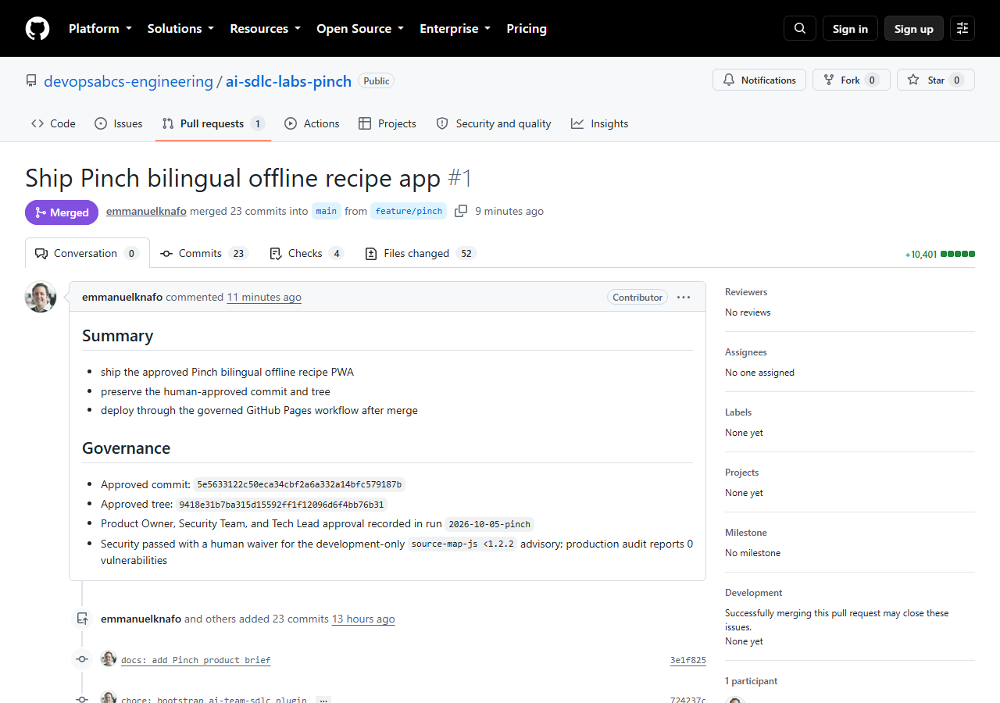
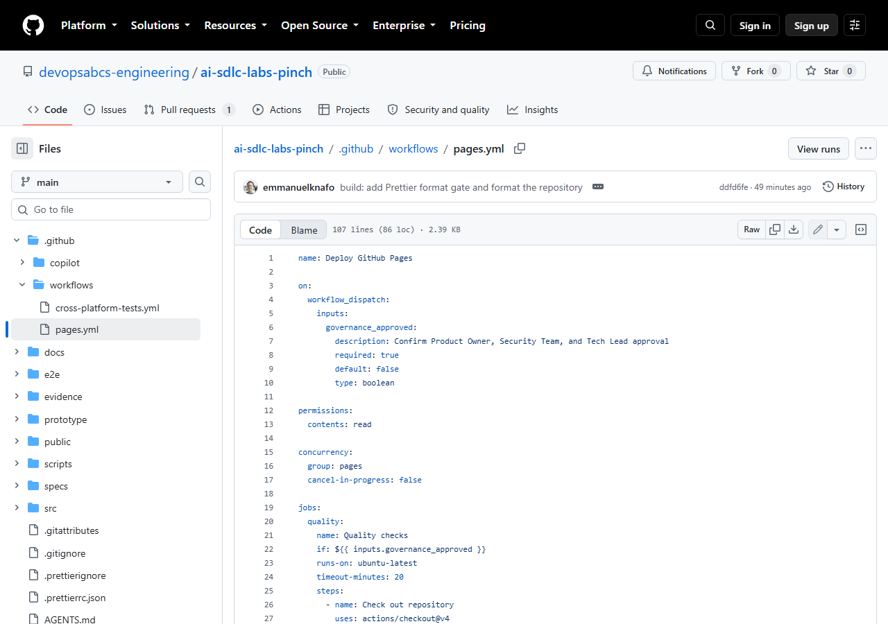
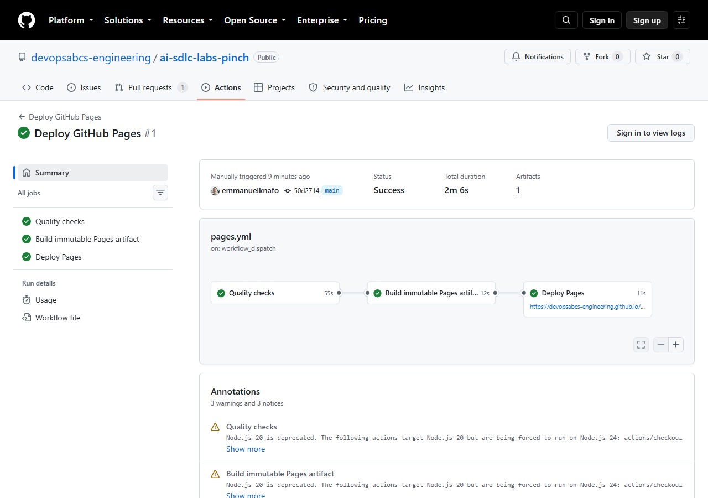
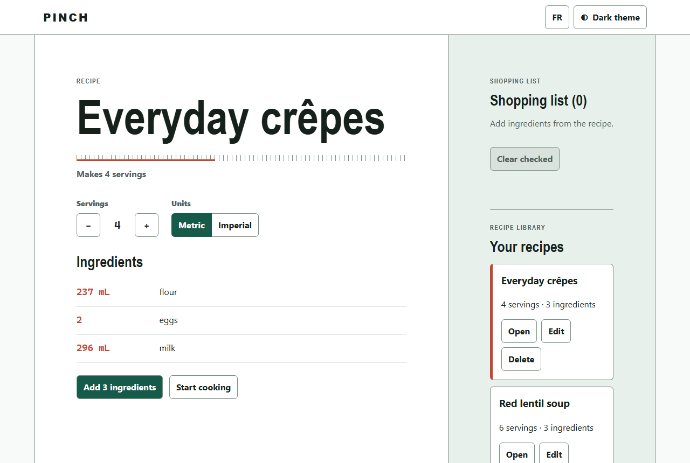
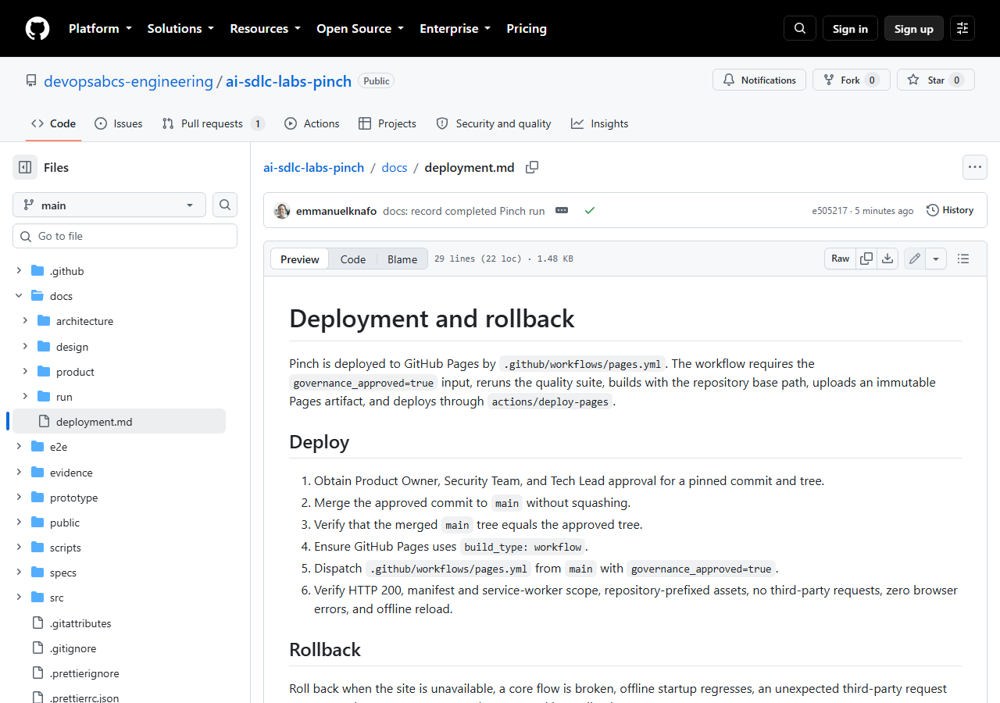

# Lab 7: Deploy to production

<span class="chip phase-deploy"><span aria-hidden="true">🚀</span> Deploy</span> <span class="chip phase-idea">30 min</span> <span class="chip phase-build">Intermediate</span>

## Overview

<div class="lab-meta" markdown>

| Item | Details |
|------|---------|
| **Duration** | 30 minutes |
| **Level** | Intermediate |
| **Prerequisites** | [Lab 6: Human sign-off and changes requested](lab-06-signoff-changes-requested.md) |
| **Checkpoint** | Tag `lab-07-end` in the reference repository: the approved artifact is live and the rollback plan is written. |
| **Next lab** | [Lab 8: Resume, recover and tear down](lab-08-resume-recover-teardown.md) |

</div>

The deploy phase ships one thing: the exact tree that three people approved. You push it, merge it without squashing, prove that `main` holds the same tree, publish it through a governed workflow and check the live site.

## Learning objectives

By the end of this lab, you will be able to:

* Run the `ait-deploy` skill only after sign-off is approved, and stop if the code differs from the approved pin.
* Push, open a pull request and merge **without squash**, then prove that `main` has the approved tree.
* Enable GitHub Pages with a GitHub Actions workflow and start it with `governance_approved=true`.
* Explain and verify the `pre-deploy`, `smoke` and `rollback-ready` gates.
* Describe how to roll back to the previous version.

## Cost and credits { #cost-and-credits }

!!! cost "A deploy run is short and cheap"
    In the recorded Pinch run, sign-off persistence and deploy together took about 8 minutes 52 seconds and 117.52 AI credits. The GitHub Pages workflow itself ran for about 2 minutes. See [Lab 0](lab-00-setup.md#cost-and-credits) for the cost of a full run.

## Steps

!!! warning "Use your own repository"
    Every command below uses the placeholders `<owner>` and `<repo>`. Replace them with **your own** practice repository. Never run these commands against the reference repositories (`ai-sdlc-labs-pinch`, `ai-team-sdlc`, the Focus Garden sample): the lab is about deploying your own copy.

Set the variables once in your PowerShell session, from the repository root:

```powershell
$Repo  = '<owner>/<repo>'
$RunId = '<run-id>'      # the folder name under .copilot-tracking, for example 2026-10-05-pinch
```

### Step 1: Check the approved pin

Deploy ships the approved artifact only. Read the sign-off record, then compare it to what you have checked out.

```powershell
git switch feature/pinch
$commit  = git rev-parse HEAD
$tree    = git rev-parse 'HEAD^{tree}'
$signoff = (Get-Content ".copilot-tracking\$RunId\state.json" -Raw | ConvertFrom-Json).signoff
$signoff.status
$signoff.artifact
"HEAD commit: $commit"
"HEAD tree:   $tree"
```

Stop here if `signoff.status` is not `approved`, or if the commit or tree differ from `signoff.artifact`. Any change after approval resets sign-off to `pending` and sends the run back to Build.

!!! success "Expected result"
    `status` is `approved`, and the commit and tree match. In the recorded Pinch run the pin was commit `5e56331` and tree `9418e31b7ba315d15592ff1f12096d6f4bb76b31`.

!!! tip "Let the agent run the chain"
    You can also ask for the whole phase in one bounded prompt, from the repository root: `copilot -p "Use the ait-deploy skill. Run ONLY the deploy phase for run <run-id>. Stop if HEAD differs from the approved pin." --allow-all-tools --no-ask-user`. The steps below are what the agent does, so you can check its work.

### Step 2: Run the pre-deploy audit gate

The `pre-deploy` gate re-checks the production dependencies before anything leaves your machine.

```powershell
npm ci
npm audit --omit=dev --audit-level=high
```

!!! success "Expected result"
    No high or critical vulnerability in the production dependencies. Pinch ships no runtime dependencies, so the recorded audit reports 0 vulnerabilities. This is the audit that the Lab 6 waiver relies on.

### Step 3: Push the branch

```powershell
git push -u origin feature/pinch
```

### Step 4: Open the pull request

Put the approved commit and tree in the description, so a reviewer can see what is being merged.

```powershell
gh pr create --repo $Repo --base main --head feature/pinch `
  --title "Ship <your app name>" `
  --body "Approved commit: $commit`nApproved tree: $tree`nApproval recorded in run $RunId."
```

<figure class="screenshot-frame" markdown>

<figcaption>The merged pull request in the reference repository. Read the Governance section: it names the approved commit, the approved tree, the recorded approval and the waiver.</figcaption>
</figure>

### Step 5: Wait for checks, then merge without squash

```powershell
gh pr checks 1 --repo $Repo --watch
gh pr merge 1 --repo $Repo --merge
```

Use the number of your own pull request in place of `1`. In the reference run the PR checks were CodeQL and the cross-platform tests.

!!! warning "Never squash or rebase here"
    `--merge` keeps the approved commit inside the history of `main`. A squash or a rebase creates new commits, and you can no longer show that the merged code is the approved code.

### Step 6: Prove the tree is the approved tree

A merge commit has a new id, so compare the **tree**, which is the content id.

```powershell
git fetch origin
$mainTree = git rev-parse 'origin/main^{tree}'
if ($mainTree -eq $tree) { 'Tree equality: OK' } else { throw "main tree $mainTree differs from approved tree $tree" }
```

!!! success "Expected result"
    The command prints `Tree equality: OK`. In the reference run the merge commit was `50d2714`, and its tree was the approved `9418e31...`.

### Step 7: Enable GitHub Pages with a workflow

```powershell
gh api --method POST "repos/$Repo/pages" -f build_type=workflow
```

!!! tip "Pages already enabled?"
    If the call fails because Pages already exists, open **Settings > Pages** in your repository and set **Source** to **GitHub Actions**. Until the first deploy ends, the site address shows a 404 page: this is normal.

### Step 8: Dispatch the governed workflow

The workflow `.github/workflows/pages.yml` runs only when a person sets the input to true:

```yaml
on:
  workflow_dispatch:
    inputs:
      governance_approved:
        description: Confirm Product Owner, Security Team, and Tech Lead approval
        required: true
        default: false
        type: boolean
```

It has three jobs: `quality` (build, lint, format, unit tests, `i18n-parity`, `portable-os`, Playwright, Lighthouse), `build-pages-artifact` (an immutable artifact built with `--base=/ai-sdlc-labs-pinch/`) and `deploy-pages`. Start it from `main`:

```powershell
gh workflow run .github/workflows/pages.yml --repo $Repo --ref main -f governance_approved=true
$id = gh run list --repo $Repo --workflow pages.yml --limit 1 --json databaseId --jq '.[0].databaseId'
gh run watch $id --repo $Repo
```

<figure class="screenshot-frame" markdown>

<figcaption>The governed workflow file on GitHub. Look at the `governance_approved` input: the default is false, so nobody deploys by accident.</figcaption>
</figure>

<figure class="screenshot-frame" markdown>

<figcaption>The successful run. Check the three jobs in order and the total duration of about 2 minutes. The reference run id is 37465190164.</figcaption>
</figure>

!!! success "Expected result"
    The run ends with `success` and the `Deploy Pages` job shows the site URL, `https://<owner>.github.io/<repo>/`.

### Step 9: Run the smoke gate on the live site

The `smoke` gate tests the live URL, not the build folder. The recorded run used a headless browser and checked:

| Check | Why it matters |
|-------|----------------|
| HTTP 200 on the home page | The site exists. |
| Manifest `start_url` and `scope` under the repository path | The app installs from the right path. |
| Service worker scope matches the live URL | Offline mode covers the whole app. |
| All assets use the repository prefix | No file is requested from the domain root. |
| 0 requests to other origins | Nothing leaves the site. |
| 0 console errors and page errors | The app starts clean. |
| Offline reload succeeds | The PWA promise holds. |

Run the first check by hand, then open the page and reload it with DevTools set to offline:

```powershell
(Invoke-WebRequest "https://<owner>.github.io/<repo>/" -Method Head -UseBasicParsing).StatusCode
```

<figure class="screenshot-frame" markdown>

<figcaption>The live Pinch app after deploy. You should see the recipe, the servings control, the Metric and Imperial toggle and the shopping list.</figcaption>
</figure>

!!! success "Expected result"
    Status code `200`, the app loads, and the page still renders after an offline reload.

### Step 10: Make the release rollback-ready

The `rollback-ready` gate passes only when the rollback plan is written down before you need it. In the reference repository it is `docs/deployment.md`.

<figure class="screenshot-frame" markdown>

<figcaption>The deployment and rollback page. Compare the six Deploy steps with what you just did, then read the Rollback section.</figcaption>
</figure>

The recorded plan, in short: roll back when the site is unavailable, a core flow is broken, offline startup regresses, an unexpected third-party request appears or browser errors cannot be fixed at once. Then:

1. Create a rollback branch from the current `main`.
2. Restore the content from the last known-good pre-release commit (for Pinch: `2aa70d7db33767f50322d82495818de9ba83c24a`).
3. Merge it through a reviewed pull request.
4. Dispatch `pages.yml` with `governance_approved=true`.
5. Repeat the complete smoke checks.

Each Pages deploy is an immutable artifact tied to one workflow run. Never roll back with a `gh-pages` branch or a manual upload.

### Step 11: Record the release

Add the live URL to `README.md` and snapshot the run record under `docs/run/<run-id>/` (Lab 8 explains the snapshot). In the reference repository this is commit `e505217`, which is also the tag `lab-07-end`.

## Checkpoint

!!! checkpoint "Check your work"
    * [ ] `signoff.status` is `approved` and HEAD matched the approved commit and tree before the push.
    * [ ] The pull request was merged with a merge commit (no squash).
    * [ ] `Tree equality: OK` printed after the merge.
    * [ ] Pages uses the workflow build type, and the run of `pages.yml` ended with `success`.
    * [ ] The live URL returned `200` and works after an offline reload.
    * [ ] A rollback plan is committed.

    Compare with the reference repository at tag `lab-07-end` (commit `e505217`).

## Bring your own idea

* **Base path.** On GitHub Pages the app lives under `/<repo>/`. The Vite `--base` value in `pages.yml` must be your repository name, and so must the manifest `start_url` and `scope`. Change `--base=/ai-sdlc-labs-pinch/` in the workflow, and in your brief if it names the path.
* **Keep the governed input.** Keep `governance_approved` and the `if:` condition on every job. Do not add a second deploy path.
* **Project gates.** Derive your smoke checks from your own app: its start page, its offline promise, its third-party rules.
* **Write the rollback plan first.** Note the last known-good commit before you merge.
* **Visibility.** Check that your GitHub plan allows Pages for the visibility of your repository.

## What went wrong in the recorded runs

* **Pinch deployed on the first dispatch** (run 37465190164, success, about 2 minutes). The pin, the tree equality and the smoke list were all checked around the push.
* **Focus Garden had two failed releases for outside reasons.** The first run was cancelled before any step ran, during a GitHub Actions incident, and was dispatched again after recovery. The second ran and failed at the performance gate: `tests/lighthouse-audit.mjs` had a Windows Chrome path hardcoded, so on the Ubuntu runner it died with `spawn ... chrome.exe ENOENT`. Every local gate had passed on a Windows machine.
* **The fix was a change after approval.** It was a two-line test change in its own pull request, so `main` was no longer byte-identical to the approved commit `5d3c73f`. The wiki records this and notes that a stricter team would ask for a new sign-off. In your run, any change after approval resets sign-off.
* **The lesson is in the Pinch brief:** no hard-coded OS paths, use Playwright's Chromium, and run the deploy workflow early.

Read the full story in the [Focus Garden evidence page](https://github.com/devopsabcs-engineering/ai-team-sdlc-sample-focus-garden/wiki/Evidence-focus-garden).

## Troubleshooting

### The site shows a 404 right after the merge

Pages serves nothing until the first workflow run ends with `success`. Check `gh run list --repo $Repo --workflow pages.yml --limit 1`, wait for the run, and reload.

### The page loads blank or files return 404

The base path does not match the repository name. Open DevTools and look at the failing URLs: if they start at `/assets/...` instead of `/<repo>/assets/...`, rebuild with `--base=/<repo>/` and dispatch again.

### The workflow was cancelled, or every job was skipped

A cancelled run in which no step ran usually comes from a platform incident: dispatch again when GitHub reports that Actions has recovered. If every job shows as skipped, `governance_approved` was false: pass `-f governance_approved=true`.

### The tree check fails

You merged with squash or rebase, or `main` changed after the approved commit. Do not deploy. Find the difference with `git diff $tree origin/main` and return to sign-off.

More help: [Troubleshooting](../troubleshooting.md).

## Knowledge check

??? question "Why compare trees and not commits?"
    A merge commit always has a new id, so commit ids differ. The tree id identifies the content, so equal trees prove that `main` holds exactly the approved files.

??? question "Why does the workflow ask for `governance_approved`?"
    It makes the human approval an explicit input to the release. The default is false, so a dispatch without the value deploys nothing.

??? question "When does the `rollback-ready` gate pass?"
    When the rollback plan is written and committed before the release, so you can use it in a bad moment without improvising.

## Summary

You verified the approved pin, pushed, merged without squash, proved tree equality, enabled Pages, ran the governed workflow, checked the live site against the smoke list and wrote the rollback plan. The deployed code is the code that people approved.

## Next steps

Continue with [Lab 8: Resume, recover and tear down](lab-08-resume-recover-teardown.md).
