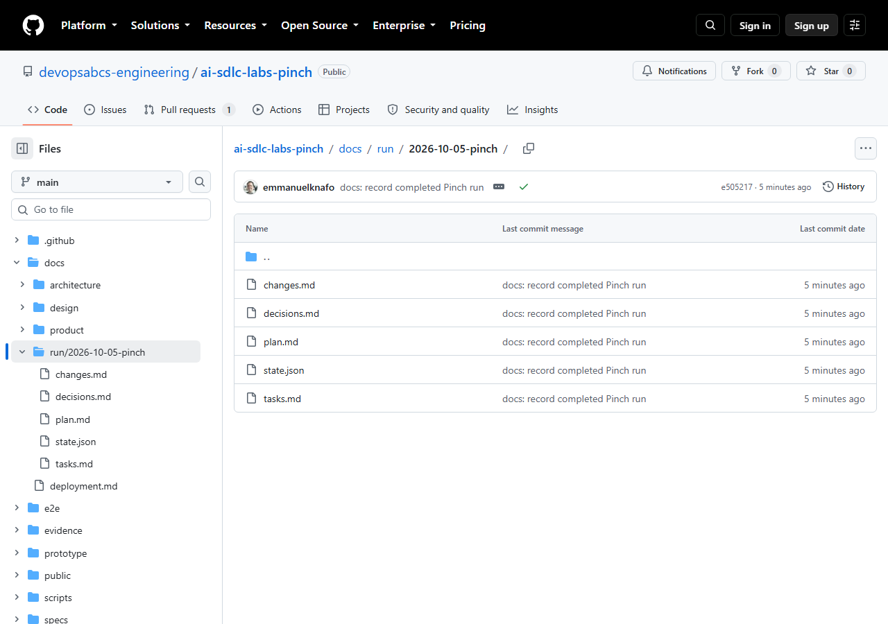
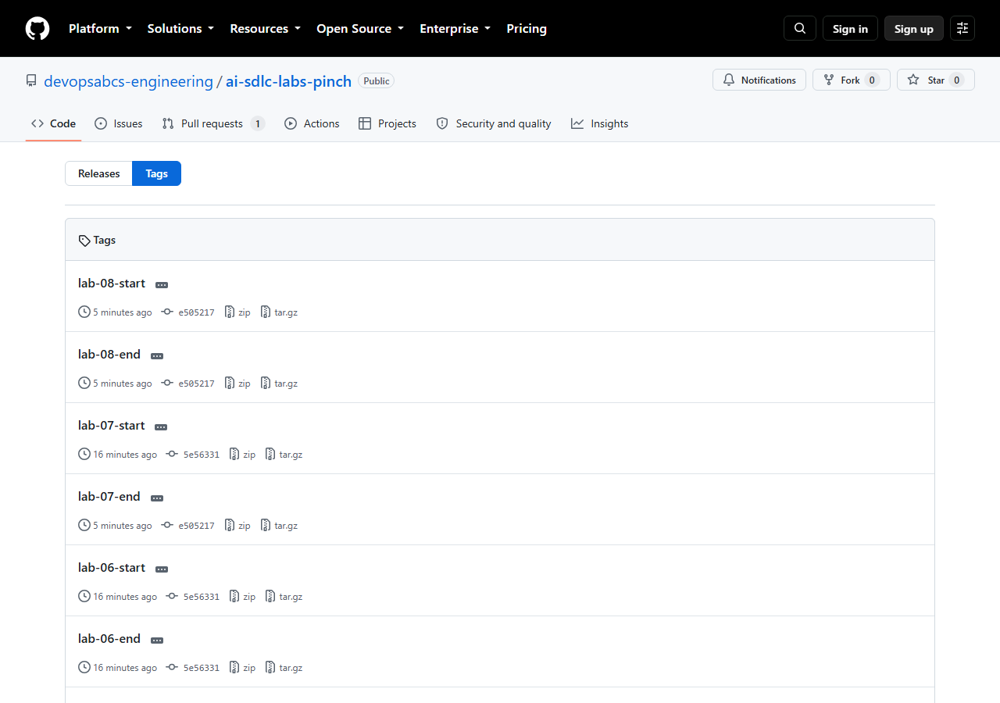

# Lab 8: Resume, recover and tear down

<span class="chip phase-orch"><span aria-hidden="true">♻️</span> All phases</span> <span class="chip phase-idea">25 min</span> <span class="chip phase-build">Intermediate</span>

## Overview

<div class="lab-meta" markdown>

| Item | Details |
|------|---------|
| **Duration** | 25 minutes |
| **Level** | Intermediate |
| **Prerequisites** | [Lab 7: Deploy to production](lab-07-deploy.md) |
| **Checkpoint** | Tag `lab-08-end` in the reference repository: the run snapshot is committed under `docs/run/` and the environment is cleaned up. |
| **Next lab** | None. This is the last lab: see the [lab map](index.md), the [glossary](../glossary.md) and [Troubleshooting](../troubleshooting.md). |

</div>

Real runs stop: a gate blocks, a terminal closes, a platform has an incident. This lab shows how to continue without redoing finished work, how to keep the evidence in your repository, what the whole build cost, and how to remove what you created.

## Learning objectives

By the end of this lab, you will be able to:

* Stop a run and resume it from `state.json` without redoing finished work.
* Reset a single task to `pending` and re-run only that task.
* Match a failure to a recovery pattern.
* Snapshot `state.json`, `plan.md`, `tasks.md`, `changes.md` and `decisions.md` to `docs/run/<run-id>/`.
* Read the cost of a whole build and plan a cheaper one.
* Tear down what the labs created (deployments, practice repositories, local folders) without touching the reference repositories.

## Cost and credits { #cost-and-credits }

!!! cost "Resuming is cheaper than restarting"
    A resume run in the Focus Garden sample took 19 minutes and about 392 credits, against about 2,097 credits for its first run. The whole Pinch build cost about 1,730 credits (table in Step 6). See [Lab 0](lab-00-setup.md#cost-and-credits) for the rules that keep a run cheap.

## Steps

!!! warning "Teardown touches your own repository only"
    Steps 7 and 8 delete things. Run them **only** against your own practice repository, and read each command before you press Enter. Never run any teardown command against `ai-sdlc-labs-pinch`, `ai-team-sdlc`, `ai-sdlc-labs` or the Focus Garden sample. If you do not have a practice repository, read these steps and skip the commands.

### Step 1: Read the run state

`state.json` is the canonical record of a run. `plan.md` and `tasks.md` are projections made from it, and when they disagree, `state.json` wins. Read it from your own tracking store, or from the snapshot in a read-only clone of the reference repository.

```powershell
git clone https://github.com/devopsabcs-engineering/ai-sdlc-labs-pinch.git "$HOME\src\pinch-reference"
Set-Location -LiteralPath "$HOME\src\pinch-reference"
git switch --detach lab-08-end
$StatePath = 'docs\run\2026-10-05-pinch\state.json'   # your own run: .copilot-tracking\<run-id>\state.json
$state = Get-Content $StatePath -Raw | ConvertFrom-Json
$state.status; $state.currentPhase
$state.tasks | Select-Object id, owner, status, retries | Format-Table -AutoSize
```

!!! success "Expected result"
    `status` is `done` and `currentPhase` is `deploy`. The table lists T-001 to T-014, all `done`. Look at `retries`: T-012 (critic review) shows 1 and T-013 (security) shows 2. T-011 shows 0 because it was reset after a human fix (Step 3).

Do not push from this clone. It is only for reading.

### Step 2: Stop a run and resume it

Stop a run with `Ctrl+C` in the terminal where `copilot` runs. State is written to disk as tasks complete, so little is lost. At the end of each run the CLI prints a session id. Two ways to continue:

```powershell
# 1. Continue the same CLI session
copilot --resume=<session-id>

# 2. Start a new session and resume by run id
copilot -p "Use the ait-sdlc-orchestrate skill. Resume run <run-id>. Run ONLY the next pending task. Do not push, do not deploy." --allow-all-tools --no-ask-user
```

The orchestrator follows these rules when it resumes:

* It reads `state.json`, then reconciles `plan.md`.
* A task left `in_progress` after a crash counts as **not done** and is run again.
* It continues at the first task that is `pending` or `in_progress` and whose dependencies are all `done`.
* `done` tasks are never redone.
* It resumes only when you give an existing run id. Without one, it creates a new run id.

!!! tip "Bounded runs resume well"
    Ask for one phase or a few tasks per prompt, and add `--share evidence\<name>.md --log-dir evidence\logs` so each run leaves a record. The Focus Garden run was resumed from `state.json` across 4 invocations.

### Step 3: Recover a blocked task

A failed gate is retried with the failure context and `retries` goes up. After 2 retries, the task becomes `blocked`, and the run stops until a human decides. In Pinch, T-011 (QA) was blocked because the agent could not install Prettier: the corporate registry refused the package with `EALLOWREMOTE`.

The recovery had four parts:

1. A human fixed the root cause (commit `ddfd6fe`: Prettier added to `package.json` and the lockfile, and a `format:check` script).
2. The decision was recorded in `decisions.md`.
3. T-011 was reset to `pending` with `retries` 0, so it got a fresh budget.
4. The run was resumed by naming the run id.

```powershell
copilot -p "Use the ait-sdlc-orchestrate skill. Resume run <run-id>. I fixed the cause of the T-011 failure. Record that decision in decisions.md, reset T-011 to pending with retries 0 and re-run only T-011. Do not push, do not deploy." --allow-all-tools --no-ask-user
```

!!! warning "Do not weaken a gate to unblock a task"
    When T-013 (security) stayed blocked because of a development-only advisory, the agent refused the "fix" that would have downgraded Vite and Vitest. A **person** recorded a waiver in `decisions.md`, with a re-check trigger. Only humans waive gates.

### Step 4: Match the failure to a recovery pattern

| What happened | What the run does | What you do |
|---------------|-------------------|-------------|
| A task is `blocked` after 2 retries (Pinch T-011, T-013) | The run stops | Fix the root cause or record a human decision, reset the task to `pending` with `retries` 0, resume by run id |
| The terminal closed or you pressed `Ctrl+C` | A task left `in_progress` counts as not done | `copilot --resume=<session-id>`, or resume by run id |
| A gate cannot run (Lab 2: the Playwright MCP was missing) | The task is `blocked`, not skipped | Give the gate its tool, or let the agent use an existing one, then resume |
| A workflow is cancelled during a platform incident (Focus Garden) | Nothing was deployed | Dispatch the workflow again when the platform recovers |
| The merged tree differs from the approved tree | Deploy must stop | Go back to sign-off |
| You want to deploy faster | Not allowed | Never bypass the governed workflow, never force-push a `gh-pages` branch |

### Step 5: Snapshot the run record into the repository

`.copilot-tracking/` is git-ignored, so the run evidence stays on your machine unless you copy it. Snapshot the five files under `docs/run/<run-id>/` and commit them.

```powershell
Set-Location -LiteralPath "$HOME\src\ai-sdlc-practice"   # your own repository
$RunId = '<run-id>'
$dest = "docs\run\$RunId"
New-Item -ItemType Directory -Force $dest | Out-Null
foreach ($f in 'state.json','plan.md','tasks.md','changes.md','decisions.md') { Copy-Item ".copilot-tracking\$RunId\$f" $dest }
git add docs/run
git commit -m "docs: record completed run"
```

<figure class="screenshot-frame" markdown>

<figcaption>The run record in the reference repository. Check that all five files are present: they are the whole story of the run, from the first task to the deploy.</figcaption>
</figure>

!!! success "Expected result"
    `git show --stat HEAD` lists the five files under `docs/run/<run-id>/`.

### Step 6: Add up the cost of the whole build

These are the real numbers from the recorded Pinch run.

| Phase | Run | Credits | Time |
|-------|-----|--------:|------|
| Lab 2: design and prototype | `lab-02-design-prototype` | 284.39 | about 15 to 25 min (the reported 11 h 12 min is a timer artifact) |
| Lab 3: requirements and architecture | `lab-03-requirements-architecture` | 88.03 | about 3.5 min |
| Lab 4: build, slices 1 | `lab-04a-build-slices-1` | 394.17 | 28 min 39 s |
| Lab 4: build, slices 2 | `lab-04b-build-slices-2` | 368.57 | 19 min 23 s |
| Lab 5: QA, critic, security | `lab-05-qa-critic-security` | 79.25 | not recorded |
| Lab 5: retry | `lab-05b-qa-critic-security-retry` | 396.72 | 32 min 54 s |
| Labs 6 and 7: sign-off and deploy | `lab-06-07-signoff-deploy` | 117.52 | 8 min 52 s |
| **Total** | | **1,728.65** | |

The bootstrap and the brief are small and not itemized. Focus Garden, which had a changes-requested loop and no bounded runs, cost about 3,300 credits (2,097 + 392 + 747 + 92).

!!! tip "What lowers the bill"
    Bound each run to one phase, stop at gates, keep the scope small (3 or 4 features), and fix a blocked task before you resume.

### Step 7: Disable Pages and clean the branches

Only for your own repository. This takes your live site offline.

```powershell
$Repo = '<owner>/<repo>'
gh api --method DELETE "repos/$Repo/pages"
git switch main
git pull
git branch -d feature/pinch
git push origin --delete feature/pinch
```

`git branch -d` refuses to delete a branch that is not merged, which is the safety you want: delete merged branches only. Keep your tags: they are your checkpoints.

### Step 8: Delete the practice repository and local files

Do this only when you are finished with the practice repository. Back up what you want to keep first.

```powershell
gh repo view $Repo --json nameWithOwner,url
Copy-Item "$HOME\src\ai-sdlc-practice\.copilot-tracking" "$HOME\evidence-backup" -Recurse   # optional
gh repo delete $Repo --yes
Set-Location -LiteralPath $HOME
Remove-Item -LiteralPath "$HOME\src\ai-sdlc-practice" -Recurse -Force
copilot plugin uninstall ai-team-sdlc
```

!!! warning "Check the name before you delete"
    `gh repo delete --yes` does not ask. Read the output of `gh repo view` first: it must be your own practice repository. If `gh repo delete` reports a missing scope, run `gh auth refresh -h github.com -s delete_repo`, then try again.

You can also remove the marketplace entry if you no longer need it (see `copilot plugin marketplace --help`). Keep `.copilot-tracking` if you want to keep the evidence.

## Final checklist

* [ ] I can read `state.json` and explain `status`, `retries` and `signoff`.
* [ ] I know two ways to resume a run, and that `done` tasks are never redone.
* [ ] I can reset one blocked task and re-run only that task.
* [ ] The run record is committed under `docs/run/<run-id>/`.
* [ ] I know what my own build cost, and I know three ways to reduce it.
* [ ] Pages is disabled and merged branches are removed in my practice repository, or I deleted it.
* [ ] I never ran a teardown command against a reference repository.

## Checkpoint

!!! checkpoint "Check your work"
    The tags `lab-08-start` and `lab-08-end` point to the same commit, `e505217`: this lab changes no code. The run snapshot is committed under `docs/run/2026-10-05-pinch/`, and the cleanup concerns your own practice repository.

<figure class="screenshot-frame" markdown>

<figcaption>The checkpoint tags. Notice that lab-08-start and lab-08-end both point to e505217, and that lab-07-end points to the same commit.</figcaption>
</figure>

## Bring your own idea

* Name each run (`lab-NN-...`), bound it to one phase, and add `--share` and `--log-dir` so you can compare cost per run.
* Keep your own table like the one in Step 6. After your second run you will see which phase costs most.
* Snapshot the run record in every checkpoint commit, not only at the end.
* Start with 3 or 4 features. A bigger scope multiplies slices, gates and retries.
* Write down the root cause and the decision each time you unblock a task.

## What went wrong in the recorded runs

* **Pinch T-011 and T-013 were blocked.** T-011 (QA) failed because the registry policy refused a package. T-013 (security) failed on a development-only advisory that had no fixed version. Both stopped after two attempts, as designed.
* **Pinch T-012 (critic review) failed once** with two blocking findings. Two fix commits followed, and the re-review passed (T-012 shows `retries` 1 in the final state).
* **One test hung once on cold start** (a `beforeEach` timeout). The unchanged rerun passed in 7.4 s.
* **The scribe sub-agent could not consolidate the inbox files** because it has no read tool, so the orchestrator did it. This is a known limit of the plugin.
* **Focus Garden was interrupted by a platform incident.** Its first release run was cancelled before any step ran, and a new dispatch fixed it.

## Troubleshooting

### The orchestrator starts a new run instead of resuming

It resumes only when you give an existing run id. Name it in the prompt: `Resume run <run-id>`. The folder name under `.copilot-tracking` is the run id.

### I lost the session id

Use the second way: start a new session and resume by run id. The state is in `.copilot-tracking/<run-id>/state.json`, not in the chat.

### The tracking folder is missing after a fresh clone

`.copilot-tracking/` is git-ignored and only exists on the machine where the run happened. The `docs/run/<run-id>/` snapshot is the committed record of the run.

### `gh repo delete` or the Pages call fails

For `gh repo delete`, add the scope with `gh auth refresh -h github.com -s delete_repo`. For the Pages call, check that Pages is enabled and that you have admin rights on the repository. Check `$Repo` with `gh repo view $Repo`.

More help: [Troubleshooting](../troubleshooting.md).

## Knowledge check

??? question "Which file wins when `plan.md` and `state.json` disagree?"
    `state.json`. `plan.md` and `tasks.md` are projections that the orchestrator regenerates from it.

??? question "A task is `blocked`. What are the two ways forward?"
    Fix the root cause and reset the task to `pending` with `retries` 0, or have a human record a waiver in `decisions.md`. An agent never waives a gate on its own.

??? question "Why does `git branch -d` suit the cleanup?"
    It refuses to delete a branch that is not merged, so you only remove work that is already in `main`.

## Summary

You can read the state of a run, resume it two ways, recover a blocked task without weakening a gate, keep the evidence in `docs/run/`, read the cost of a whole build (about 1,730 credits for Pinch) and remove your practice resources safely. You have now completed the full lifecycle, from an idea to a deployed and approved app.

## Next steps

You have completed the labs. Where to go next:

* Run the lifecycle again on your own idea, with a small scope.
* Read the [Focus Garden evidence](https://github.com/devopsabcs-engineering/ai-team-sdlc-sample-focus-garden/wiki/Evidence-focus-garden) for a run with a changes-requested loop.
* Explore the [plugin repository](https://github.com/devopsabcs-engineering/ai-team-sdlc) and contribute.
* Return to the [lab map](index.md), the [glossary](../glossary.md) or [Troubleshooting](../troubleshooting.md).
