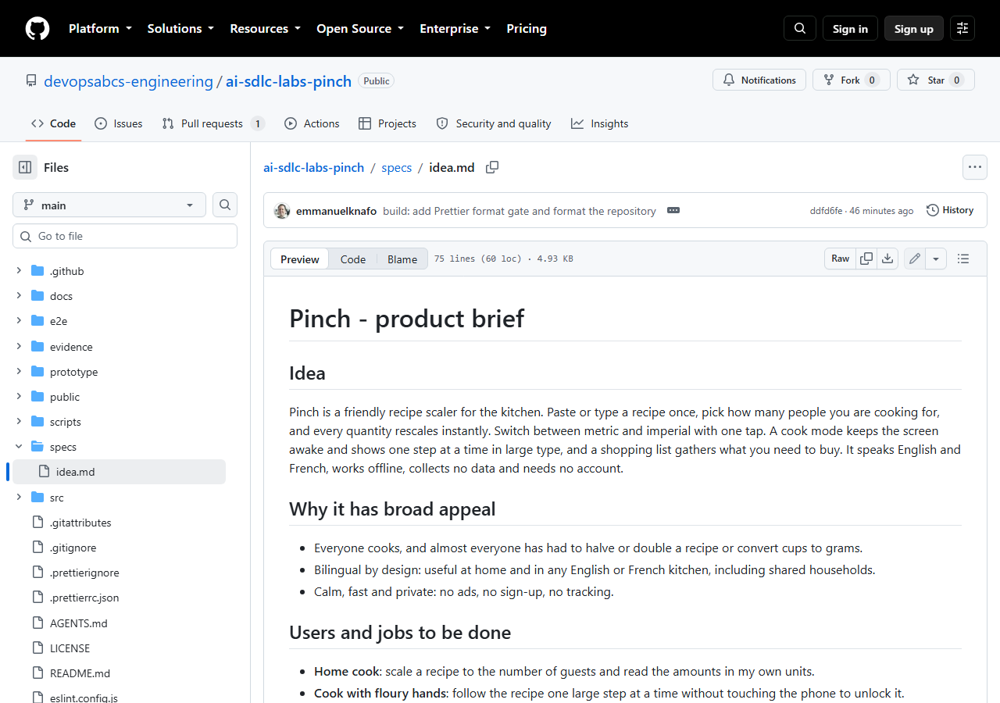
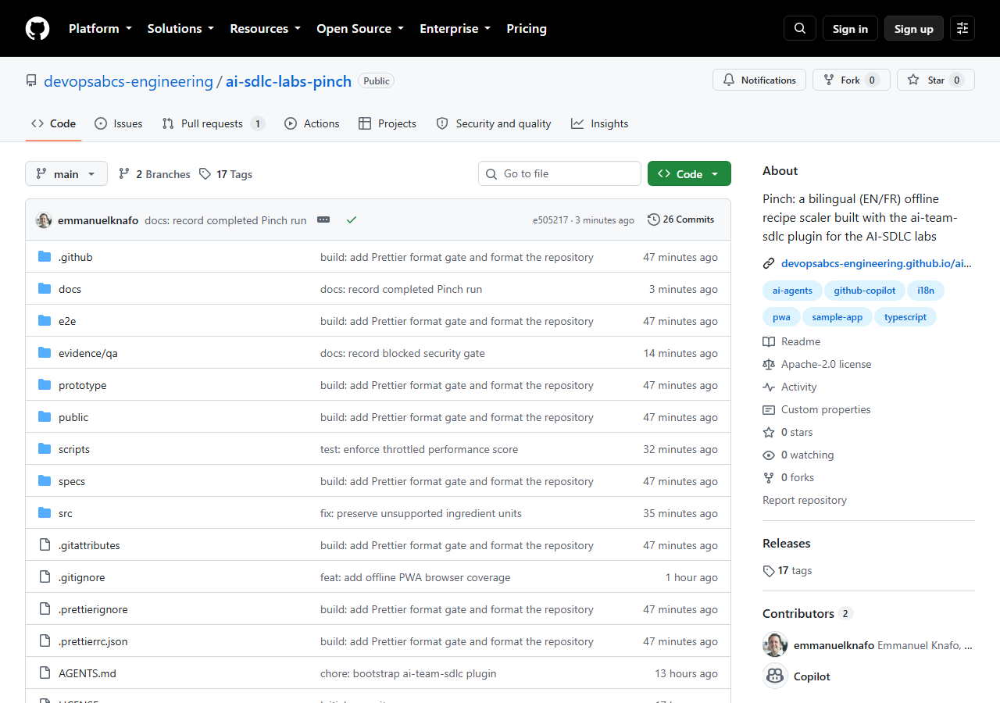

# Atelier 1 : De l'idée à l'énoncé

<span class="chip phase-idea"><span aria-hidden="true">💡</span> Idée</span> <span class="chip phase-idea">25 min</span> <span class="chip phase-plan">Débutant</span>

## Présentation

<div class="lab-meta" markdown>

| Élément | Détails |
|---------|---------|
| **Durée** | 25 minutes |
| **Niveau** | Débutant |
| **Prérequis** | [Atelier 0 : Prérequis et installation](lab-00-setup.md) |
| **Point de contrôle** | Étiquette `lab-01-end` dans le dépôt de référence : `specs/idea.md` est validé. |
| **Atelier suivant** | [Atelier 2 : Conception et prototype](lab-02-design-prototype.md) |

</div>

Tous les agents du cycle de vie lisent d'abord un même fichier : l'énoncé du produit. Dans cet atelier, vous le rédigez. Aucun agent ne s'exécute ici. Vous jouez le rôle du responsable produit, et la qualité de ce seul fichier détermine le coût et la sécurité de tous les ateliers suivants.

L'exemple est **Pinch**, un outil bilingue (FR/EN) de mise à l'échelle de recettes, qui fonctionne hors ligne. Vous pouvez suivre l'énoncé de Pinch tel quel ou rédiger le vôtre (voir [Apportez votre propre idée](#bring-your-own-idea)).

## Objectifs d'apprentissage

À la fin de cet atelier, vous serez en mesure de :

* Rédiger `specs/idea.md` : l'idée, les utilisateurs, une portée numérotée pour la v1 et une liste explicite d'exclusions.
* Ajouter des exigences non fonctionnelles et une section de livraison qui nomment les passerelles de qualité que l'exécution doit franchir.
* Ajouter une section « Règles d'exécution pour les agents » : branche de travail, Conventional Commits, ne jamais pousser, ne jamais déployer avant l'approbation.
* Décrire le contenu du registre de suivi `.copilot-tracking/<run-id>/`.

## Coûts et crédits

!!! cost "Cet atelier est presque gratuit, mais il détermine le coût des autres"
    La rédaction de l'énoncé ne lance aucune exécution d'agent. Le vrai coût vient plus tard : la construction enregistrée de Pinch a consommé environ 1 730 crédits au total (voir l'[atelier 8](lab-08-resume-recover-teardown.md) pour le détail). Un énoncé court, à la portée réduite, est le moyen le plus économique de faire baisser ce chiffre. Les conseils généraux se trouvent dans [Coûts et crédits](lab-00-setup.md#cost-and-credits), à l'atelier 0.

## Étapes

### Étape 1 : Créer le fichier de l'énoncé

Travaillez dans le dépôt d'entraînement de l'atelier 0. Le nom du dossier `specs` compte : les ateliers suivants dirigent l'orchestrateur vers `specs/idea.md`.

```powershell
Set-Location -LiteralPath "$HOME\src\ai-sdlc-practice"
New-Item -ItemType Directory -Force specs | Out-Null
notepad specs\idea.md
```

!!! tip "Partir de l'énoncé de Pinch"
    Pour suivre Pinch à la lettre, copiez l'énoncé enregistré depuis le dépôt de référence au lieu de le taper :

    ```powershell
    git clone https://github.com/devopsabcs-engineering/ai-sdlc-labs-pinch "$HOME\src\ai-sdlc-labs-pinch"
    git -C "$HOME\src\ai-sdlc-labs-pinch" show lab-01-end:specs/idea.md | Set-Content specs\idea.md -Encoding utf8
    ```

    Lisez ensuite les étapes ci-dessous pour comprendre chaque section avant de continuer.

??? example "Énoncé complet de Pinch à copier-coller (75 lignes)"
    Utilisez le bouton de copie en haut à droite du bloc, collez le contenu dans `specs\idea.md` et enregistrez-le en UTF-8. C'est le fichier exact de l'étiquette `lab-01-end`. Il est rédigé en anglais, comme dans l'exécution de référence.

    ```markdown title="specs/idea.md"
    # Pinch - product brief

    ## Idea

    Pinch is a friendly recipe scaler for the kitchen. Paste or type a recipe once, pick how many people you are cooking for,
    and every quantity rescales instantly. Switch between metric and imperial with one tap. A cook mode keeps the screen
    awake and shows one step at a time in large type, and a shopping list gathers what you need to buy. It speaks English and
    French, works offline, collects no data and needs no account.

    ## Why it has broad appeal

    - Everyone cooks, and almost everyone has had to halve or double a recipe or convert cups to grams.
    - Bilingual by design: useful at home and in any English or French kitchen, including shared households.
    - Calm, fast and private: no ads, no sign-up, no tracking.

    ## Users and jobs to be done

    - **Home cook**: scale a recipe to the number of guests and read the amounts in my own units.
    - **Cook with floury hands**: follow the recipe one large step at a time without touching the phone to unlock it.
    - **Shopper**: turn the ingredients of one or more recipes into a single checklist.
    - **Francophone or anglophone user**: use the whole app, and read recipes, in my language.

    ## Scope (v1)

    1. Recipe entry: a title, a base number of servings and ingredient lines such as `250 g flour` or `1 1/2 cup milk`,
       plus numbered steps. Parse quantity (integers, decimals, fractions and mixed numbers), unit and name; keep unparsed
       lines as plain text.
    2. Servings scaler: change servings and all parsed quantities rescale, shown as friendly fractions where natural
       (for example 1/2, 1 1/4) and rounded sensibly for grams and millilitres.
    3. Unit toggle between metric and imperial for mass and volume, using documented conversion factors. Unknown units
       are left unchanged.
    4. Cook mode: full-screen, one step at a time, large type, previous and next by button, keyboard and swipe, with the
       Screen Wake Lock API where supported and a graceful message where not.
    5. Shopping list: add the scaled ingredients of the current recipe, merge identical items and units, tick items off,
       clear checked, and keep the list across sessions.
    6. A small library of recipes saved on the device, with three bilingual sample recipes to start from.
    7. Full English and French UI with a language switcher, the language remembered, `lang` set on the document, and
       locale-aware number formatting (decimal comma in French). No untranslated key may ship: a script must fail the build
       when the two catalogs differ.
    8. Installable PWA that works fully offline. All data stays in localStorage on the device. Export and import as JSON,
       and a clear-all-data button.
    9. Responsive from 360 px phones to wide desktops; WCAG 2.1 AA contrast; full keyboard operation;
        `prefers-reduced-motion` respected.

    Out of scope for v1: accounts, sync across devices, importing from URLs, nutrition data, photos, and any server.

    ## Non-functional requirements

    - Static site only. Stack: Vite and TypeScript with no UI framework, CSS variables for theming, a light and a dark theme.
    - Unit tests with Vitest (quantity parsing, fraction formatting, scaling, unit conversion, list merging,
      import/export, catalog parity). End-to-end tests with Playwright (scale, convert, cook mode, shopping list, language switch).
      ESLint and Prettier. `npm audit` clean for high and critical.
    - Every script and test must run on Linux and Windows: no hard-coded OS paths. Use Playwright's Chromium, not an installed browser.
    - Lighthouse-style smoke: installable manifest, service worker, performance 0.9 or better on a throttled run.
    - Secrets: none. No third-party network calls at runtime.

    ## Delivery

    - Production target: GitHub Pages for this repository through a GitHub Actions workflow
      (`https://devopsabcs-engineering.github.io/ai-sdlc-labs-pinch/`), with the Vite `base` set to `/ai-sdlc-labs-pinch/`.
    - Gates: `design-review`, `prototype-review`, `spec-review`, build, lint, unit, acceptance (e2e), an i18n parity gate,
      critic review, security (secrets, SAST, dependency audit, privacy check), then the human sign-off, then `pre-deploy`,
      `smoke`, `rollback-ready`.
    - The release workflow must be manually dispatched and require a `governance_approved` input, as in the plugin's sample.

    ## Run rules for the agents

    - This run is a teaching artifact for eight bilingual labs. Work in small bounded steps. At the end of each lab's step,
      commit with a Conventional Commit message and stop; the operator tags `lab-NN-end`.
    - Work on a git branch named `feature/pinch`. Never push and never deploy before the human sign-off is recorded.
    - Pause at the sign-off gate and wait. Do not populate approvers yourself.
    - Keep scope small. Prefer the simplest implementation that satisfies the acceptance criteria, and keep the number of
      files and agent invocations low, because learners will reproduce this and pay per run.
    - If a plugin component does not naturally apply (for example a backend developer agent for a backend-less app), record a
      justified skip in `decisions.md`.
    ```

    !!! warning "Changez l'URL de livraison pour votre propre dépôt"
        La section `Delivery` nomme le dépôt de référence. Si vous déployez depuis votre propre dépôt GitHub à l'atelier 7, remplacez `devopsabcs-engineering`, `ai-sdlc-labs-pinch` et le chemin `base` par votre compte et le nom de votre dépôt.

### Étape 2 : Décrire l'idée, l'attrait et les utilisateurs

Commencez par trois courtes sections. L'énoncé de référence s'intitule `Pinch - product brief` (il est rédigé en anglais) et commence ainsi :

```markdown
## Idea

Pinch is a friendly recipe scaler for the kitchen. Paste or type a recipe once, pick how many people you are cooking for,
and every quantity rescales instantly. ... It speaks English and French, works offline, collects no data and needs no account.

## Why it has broad appeal
## Users and jobs to be done
```

La section des utilisateurs présente quatre personnes, chacune avec une tâche à accomplir : la personne qui cuisine à la maison, celle qui cuisine les mains enfarinées, celle qui fait les courses et l'utilisateur francophone ou anglophone. Écrivez des tâches, pas des fonctionnalités : « suivre la recette une grande étape à la fois, sans toucher au téléphone pour le déverrouiller ».

<figure class="screenshot-frame" markdown>

<figcaption>L'énoncé affiché sur GitHub. Regardez l'en-tête du fichier (75 lignes) et les titres de section que toutes les phases suivantes lisent. Le message de validation dans la bannière provient d'un atelier ultérieur.</figcaption>
</figure>

### Étape 3 : Rédiger une portée numérotée pour la v1 et une liste d'exclusions

Numérotez les éléments de la portée. Les agents et les réviseurs parleront plus tard de « l'élément 7 », et ces numéros deviennent la base des exigences de l'atelier 3. L'énoncé de Pinch compte neuf éléments, par exemple :

```markdown
7. Full English and French UI with a language switcher, the language remembered, `lang` set on the document, and
   locale-aware number formatting (decimal comma in French). No untranslated key may ship: a script must fail the build
   when the two catalogs differ.
```

Remarquez que cet élément est vérifiable : un script peut faire échouer la construction. Rédigez chaque élément de sorte que quelqu'un puisse répondre par oui ou par non.

Dites ensuite ce que vous ne construirez **pas**. Pinch exclut les comptes, la synchronisation entre appareils, l'importation depuis des URL, les données nutritionnelles, les photos et tout serveur. Une liste d'exclusions explicite est la meilleure protection contre un agent qui ajoute des fonctionnalités que vous n'avez pas demandées.

### Étape 4 : Ajouter les exigences non fonctionnelles et la livraison

Énoncez une seule fois le cadre technique, dans l'énoncé :

* Un site statique avec Vite et TypeScript, sans cadre d'interface, avec un thème clair et un thème sombre.
* Des tests unitaires Vitest, des tests de bout en bout Playwright, ESLint et Prettier, et `npm audit` sans vulnérabilité élevée ni critique.
* Chaque script et chaque test doivent s'exécuter sous Linux et sous Windows : aucun chemin propre à un système d'exploitation, utilisez le Chromium de Playwright.
* Un test de fumée de type Lighthouse : manifeste installable, service worker, performance de 0,9 ou plus lors d'un test avec limitation de débit.

Donnez ensuite la cible de livraison et les passerelles. Pinch se déploie sur GitHub Pages au moyen d'un flux de travail lancé manuellement, qui exige une entrée `governance_approved`. La liste des passerelles de l'énoncé se lit dans l'ordre : `design-review`, `prototype-review`, `spec-review`, build, lint, unit, acceptation (e2e), une passerelle de parité i18n, revue critique, sécurité, puis l'approbation humaine, puis `pre-deploy`, `smoke` et `rollback-ready`.

!!! warning "Pourquoi la ligne sur la portabilité figure dans l'énoncé"
    Lors de l'exécution précédente, Focus Garden, un chemin Chrome propre à Windows dans le test Lighthouse a fait échouer la première livraison sous Linux. L'énoncé de Pinch dit « no hard-coded OS paths; use Playwright Chromium » pour que les agents évitent la même erreur.

### Étape 5 : Rédiger les règles d'exécution pour les agents

Cette section transforme une liste de souhaits en une exécution sûre. L'énoncé de Pinch dit, en résumé :

* Travailler par petites étapes bornées. À la fin de chaque étape, valider avec un message Conventional Commit, puis s'arrêter.
* Travailler sur une branche Git nommée `feature/pinch`. Ne jamais pousser et ne jamais déployer avant que l'approbation humaine soit consignée.
* S'arrêter à la passerelle d'approbation et attendre. Ne pas remplir soi-même les approbateurs.
* Garder la portée réduite, car les apprenants reproduisent l'exemple et paient à chaque exécution.
* Si un composant du plugin ne s'applique pas (par exemple un agent de développement back-end pour une application sans back-end), consigner une omission justifiée dans `decisions.md`.

!!! tip "Où l'état de l'exécution apparaîtra"
    La première exécution du cycle de vie crée `.copilot-tracking/<run-id>/`, où `<run-id>` est la date suivie d'un nom court (l'exécution de référence est `2026-10-05-pinch`). Ce dossier contient `state.json` (l'état de référence), `plan.md` et `tasks.md` (des vues lisibles de cet état), `changes.md`, `decisions.md` et un dossier `inbox/` où chaque agent dépose son propre fichier de résultat. Le dossier est ignoré par Git. Vous n'en créez rien à la main.

### Étape 6 : Vérifier et valider l'énoncé

```powershell
(Get-Content specs\idea.md).Count
Select-String -Path specs\idea.md -Pattern '^## ' | ForEach-Object { $_.Line }
git add specs/idea.md
git commit -m "docs: add product brief"
```

<figure class="screenshot-frame" markdown>

<figcaption>La racine du dépôt de référence terminé, à titre d'orientation seulement. Votre dépôt compte beaucoup moins de dossiers à ce stade : repérez le dossier `specs` qui contient l'énoncé.</figcaption>
</figure>

!!! success "Résultat attendu"
    Pour l'énoncé de Pinch, le nombre de lignes est `75` et les titres comprennent `Idea`, `Why it has broad appeal`, `Users and jobs to be done`, `Scope (v1)`, `Non-functional requirements`, `Delivery` et `Run rules for the agents`. `git log --oneline` affiche votre nouvelle validation.

## Point de contrôle

!!! checkpoint "Étiquette lab-01-end"
    Dans le dépôt de référence, `lab-01-end` pointe vers le commit `22d3f4e`, et `specs/idea.md` est validé. L'énoncé lui-même a été ajouté plus tôt, dans le commit `3e1f825` (« docs: add Pinch product brief »). C'est pourquoi `lab-01-start` et `lab-01-end` désignent le même commit, et que `git diff lab-01-start lab-01-end --stat` n'affiche rien.

Pour vérifier avec la référence :

```powershell
git clone https://github.com/devopsabcs-engineering/ai-sdlc-labs-pinch "$HOME\src\ai-sdlc-labs-pinch"
Set-Location -LiteralPath "$HOME\src\ai-sdlc-labs-pinch"
git checkout lab-01-end
(Get-Content specs\idea.md).Count
git show --stat --oneline 3e1f825
```

Le nombre est `75`, et la dernière commande liste `specs/idea.md` avec 75 insertions. Revenez à l'état le plus récent avec `git checkout main`.

## Apportez votre propre idée { #bring-your-own-idea }

Utilisez votre propre produit avec le même parcours. Une liste de contrôle :

* [ ] Un paragraphe qui dit ce que le produit fait et pour qui, en mots simples.
* [ ] De deux à quatre utilisateurs, chacun avec une tâche à accomplir.
* [ ] Une portée numérotée pour la v1 d'environ 8 ou 9 éléments, chacun vérifiable (oui ou non).
* [ ] Une liste d'exclusions explicite : comptes, serveurs, paiements, tout ce que vous ne voulez pas voir construit.
* [ ] Des exigences non fonctionnelles : pile technologique, tests, accessibilité, et « fonctionne sous Linux et sous Windows, aucun chemin propre à un système ».
* [ ] Une cible de livraison et la liste des passerelles, y compris l'approbation humaine avant le déploiement.
* [ ] Des règles d'exécution : étapes bornées, Conventional Commits, ne jamais pousser ni déployer avant l'approbation, s'arrêter à l'approbation.

!!! tip "Portée économique"
    Limitez la v1 à 3 ou 4 fonctionnalités et à un site statique sans serveur. Chaque fonctionnalité de plus ajoute des tâches, des passerelles et des crédits dans tous les ateliers suivants. Vous pourrez toujours rédiger un deuxième énoncé pour la v2.

## Ce qui n'a pas fonctionné dans l'exécution enregistrée

Rien n'a échoué dans cet atelier, puisqu'aucun agent ne s'est exécuté. La seule vraie leçon vient d'un projet précédent : les deux premières tentatives de livraison de Focus Garden ont échoué pour des raisons externes, et la seconde parce que `tests/lighthouse-audit.mjs` contenait en dur un chemin Chrome propre à Windows. L'énoncé de Pinch exige donc des scripts portables, et l'atelier 4 montre cette règle mise à l'épreuve.

## Dépannage

### `git add` ignore l'énoncé

Exécutez `git check-ignore -v specs/idea.md`. Si une règle correspond, supprimez-la ou restreignez-la dans `.gitignore`. Seul `.copilot-tracking/` doit être ignoré, pas `specs/`.

### Les accents s'affichent mal dans le fichier

Enregistrez le fichier en UTF-8. Dans PowerShell, utilisez `Set-Content -Encoding utf8` comme indiqué plus haut, et gardez le réglage de console UTF-8 de l'atelier 0.

### L'énoncé dépasse quelques pages

Un long énoncé oblige chaque agent à lire davantage et coûte plus cher à chaque exécution. Déplacez les détails dans des documents ultérieurs (le PRD à l'atelier 3), et limitez l'énoncé à l'idée, à la portée, aux limites, aux passerelles et aux règles d'exécution.

## Vérification des connaissances

??? question "Pourquoi énumérer ce qui est exclu de la portée ?"
    Un agent cherche à être utile. Sans liste d'exclusions claire, il peut ajouter des comptes, la synchronisation ou un serveur. La liste garde la construction petite et le coût prévisible.

??? question "Quelles règles d'exécution rendent les agents sûrs ?"
    Des étapes bornées avec une validation après chacune, une branche de travail, ne jamais pousser ni déployer avant l'approbation humaine, et s'arrêter à la passerelle d'approbation sans remplir les approbateurs.

??? question "`.copilot-tracking/` fait-il partie du code source ?"
    Non. C'est l'état de l'exécution, et il est ignoré par Git. `state.json` fait référence ; `plan.md` et `tasks.md` en sont des vues.

## Résumé

Vous avez rédigé `specs/idea.md` : l'idée, les utilisateurs, une portée numérotée pour la v1, une liste d'exclusions, les exigences non fonctionnelles, la liste des passerelles et les règles d'exécution. Vous savez que la première exécution du cycle de vie crée `.copilot-tracking/<run-id>/`, et que l'énoncé est l'endroit le plus économique pour maîtriser la portée et le coût.

## Prochaines étapes

Poursuivez avec l'[atelier 2 : Conception et prototype](lab-02-design-prototype.md), où les premiers agents transforment l'énoncé en conception et en prototype cliquable.
