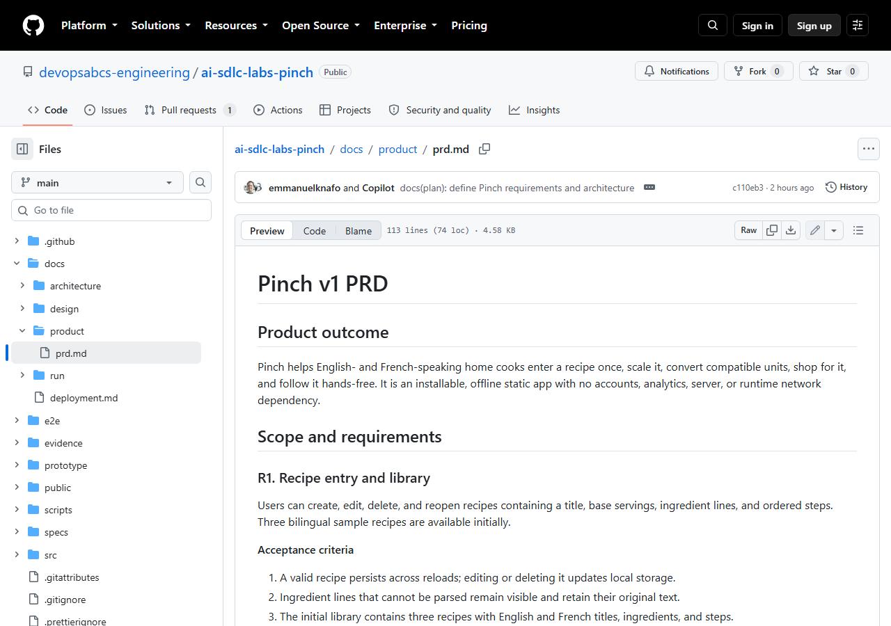
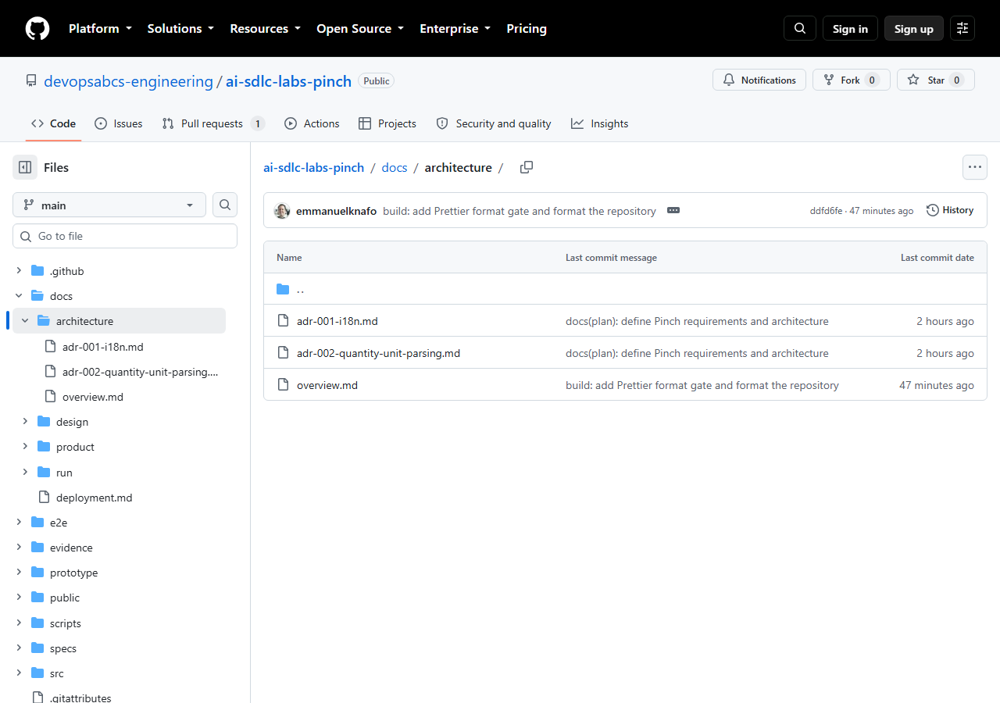
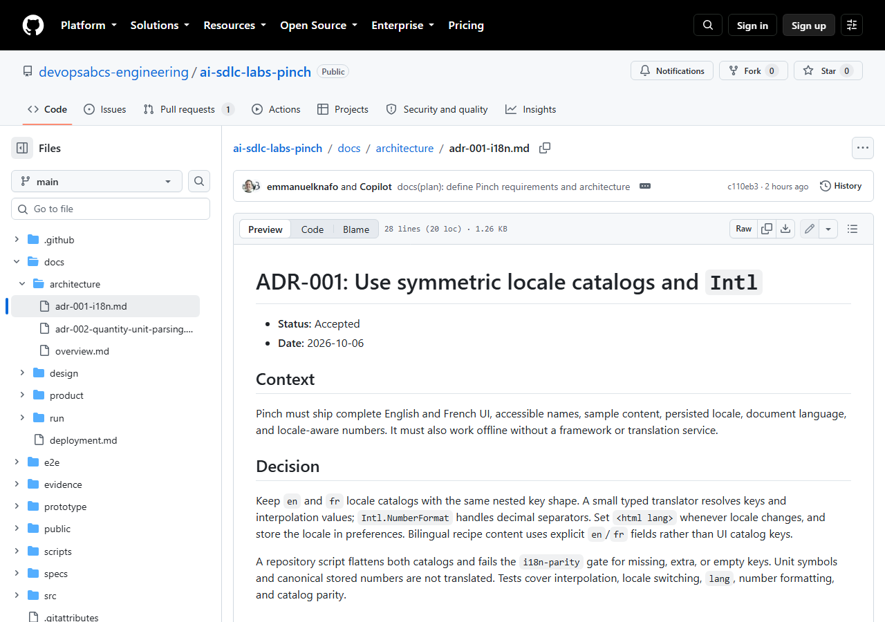

# Atelier 3 : Exigences et architecture

<span class="chip phase-plan"><span aria-hidden="true">🧭</span> Planification</span> <span class="chip phase-idea">35 min</span> <span class="chip phase-build">Intermédiaire</span>

## Présentation

<div class="lab-meta" markdown>

| Élément | Détails |
|---------|---------|
| **Durée** | 35 minutes |
| **Niveau** | Intermédiaire |
| **Prérequis** | [Atelier 2 : Conception et prototype](lab-02-design-prototype.md) |
| **Point de contrôle** | Étiquette `lab-03-end` dans le dépôt de référence : le PRD, la spécification technique et les ADR sont validés et `spec-review` a réussi. |
| **Atelier suivant** | [Atelier 4 : Construction par tranches](lab-04-build-in-slices.md) |

</div>

L'énoncé dit *ce que* vous voulez. La conception montre *l'impression d'usage*. Cet atelier transforme les deux en une spécification à partir de laquelle un agent peut construire sans deviner : un document d'exigences produit (PRD), une architecture, deux fiches de décision et un carnet de tranches à construire.

## Objectifs d'apprentissage

À la fin de cet atelier, vous serez en mesure de :

* Exécuter les agents responsable produit et architecte avec la compétence (skill) `ait-tech-specs` pour obtenir un PRD et une spécification technique.
* Lire les fiches de décision d'architecture (ADR) et les critères d'acceptation numérotés.
* Reconnaître un échec de `spec-review`, lire ses constats et vérifier que la correction les règle.
* Relier chaque exigence à une tranche de construction, et voir comment les passerelles propres au projet (`i18n-parity`, `portable-os`) entrent dans le carnet.

## Coûts et crédits { #cost-and-credits }

!!! cost "Environ 88 crédits et 3,5 minutes dans l'exécution enregistrée"
    Cet atelier coûte peu : l'exécution enregistrée a consommé **88,03 crédits** en environ **3,5 minutes**, avec un `spec-review` échoué puis un `spec-review` réussi. La lecture et la vérification des artefacts occupent l'essentiel des 35 minutes. Consultez l'[atelier 0](lab-00-setup.md#cost-and-credits) pour le portrait complet des coûts.

## Étapes

### Étape 1 : Vérifier le point de départ

Travaillez à la racine de votre dépôt d'entraînement, avec la console UTF-8 de l'atelier 0. Les ateliers 1 et 2 doivent être terminés : l'énoncé est dans `specs/idea.md`, la conception dans `docs/design/` et le prototype dans `prototype/`.

```powershell
git status --short
git log --oneline -3
Get-ChildItem .copilot-tracking -Directory
Get-Content .copilot-tracking\<run-id>\plan.md
```

Remplacez `<run-id>` par le nom du dossier affiché par la commande précédente (l'exécution enregistrée utilisait `2026-10-05-pinch`).

!!! success "Résultat attendu"
    `git status` est propre. Dans `plan.md`, T-001 (conception) et T-002 (prototype) sont cochées `[x]`, et T-003 (spécification) est encore ouverte.

!!! tip "Dépôt de référence seulement"
    Le registre de suivi est ignoré par Git : un clone neuf du dépôt de référence n'en contient pas. Si vous voulez seulement lire les résultats, sautez l'exécution et ouvrez les artefacts à l'étiquette `lab-03-end` (voir [Point de contrôle](#checkpoint)).

### Étape 2 : Lancer la phase de spécification

Lancez une seule phase bornée. L'invite nomme la compétence, la tâche, les livrables et l'endroit où s'arrêter.

```powershell
New-Item -ItemType Directory -Force evidence\logs | Out-Null
copilot -p "Use the ait-sdlc-orchestrate skill and resume the run. Run ONLY task T-003 with the ait-tech-specs skill: write docs/product/prd.md with numbered requirements R1.. and numbered acceptance criteria, docs/architecture/overview.md, and one ADR per binding decision. Then append the build backlog as tasks T-004 to T-010, one slice each, to state.json with requiredGates, adding the project gates i18n-parity and portable-os. Run the spec-review gate; if it fails, fix the findings and run it again. Commit with a Conventional Commit message on the current branch and stop. Do not push, do not deploy." --allow-all-tools --allow-all-paths --allow-all-urls --no-ask-user --share evidence\lab-03-requirements-architecture.md --log-dir evidence\logs
```

Vous pouvez aussi lancer `copilot` en mode interactif et coller la même invite. Dans VS Code, l'invite correspondante est `/product-specs`.

<figure class="screenshot-frame" markdown>

<figcaption>Le PRD (113 lignes dans l'exécution enregistrée). Regardez les critères numérotés sous R1 : chacun est un énoncé qu'une personne qui teste peut vérifier.</figcaption>
</figure>

!!! success "Résultat attendu"
    L'agent termine par un bloc de résultat et un commit. Dans l'exécution enregistrée, le commit était `c110eb3` « docs(plan): define Pinch requirements and architecture ».

### Étape 3 : Lire le PRD

Ouvrez `docs/product/prd.md`. Il contient un résultat attendu du produit, les exigences `R1` à `R8`, trois critères d'acceptation chacune (24 au total), une liste de non-objectifs et un énoncé de réussite. Par exemple, l'exigence R2 (le document est rédigé en anglais) :

```markdown
### R2. Quantity scaling and unit conversion

**Acceptance criteria**

1. Integers, decimals, fractions, and mixed numbers scale by `target servings / base servings`.
2. Compatible mass and volume units use the documented conversion table; unknown or
   dimension-incompatible units remain as written.
```

Deux habitudes à adopter : chaque critère est numéroté (le contrôle de la qualité, à l'atelier 5, les vérifie un à un), et les non-objectifs (comptes, synchronisation infonuagique, serveur) disent ce que les agents ne doivent **pas** construire.

### Étape 4 : Lire l'architecture et les ADR

```powershell
Get-ChildItem docs\architecture
```

<figure class="screenshot-frame" markdown>

<figcaption>Le dossier d'architecture : une vue d'ensemble et deux ADR. Chaque ADR consigne une décision qui s'impose.</figcaption>
</figure>

`overview.md` décrit la forme de la solution (une application d'une seule page en Vite et TypeScript, sans cadriciel, sans serveur et sans appel tiers à l'exécution), les composants, le modèle de données, les flux principaux et une carte de vérification qui relie chaque préoccupation à sa preuve.

Les deux ADR sont courtes et suivent le plan Contexte, Décision, Conséquences :

* **ADR-001** conserve des catalogues `en` et `fr` symétriques, avec la même structure de clés, et ajoute la passerelle `i18n-parity`, qui échoue en cas de clé manquante, en trop ou vide.
* **ADR-002** n'analyse qu'un préfixe de quantité reconnu, ne convertit qu'à l'intérieur d'une même dimension (masse ou volume) et conserve telles quelles les unités inconnues et les lignes non analysées.

<figure class="screenshot-frame" markdown>

<figcaption>L'ADR-001 sur GitHub. Lisez le paragraphe Decision : il nomme la passerelle (`i18n-parity`) qui fera respecter cette décision à l'atelier 4.</figcaption>
</figure>

### Étape 5 : Examiner le résultat de spec-review

`spec-review` est la passerelle de cette phase. Dans l'exécution enregistrée, elle a **échoué d'abord** puis réussi à la reprise. Cherchez les constats dans la transcription partagée :

```powershell
Select-String -Path evidence\lab-03-requirements-architecture.md -Pattern 'spec-review' | Select-Object -First 10
```

Les trois constats étaient réels et précis :

1. Les facteurs de conversion et l'arrondi n'étaient pas prêts à implémenter (désormais la table de conversion et les règles d'arrondi de l'ADR-002).
2. Le modèle de données laissait entendre que les recettes saisies par l'utilisateur exigeaient une duplication bilingue manuelle (désormais modélisées comme du contenu localisé, avec une valeur de repli obligatoire).
3. Les exigences n'étaient pas traçables jusqu'aux tranches de construction (un tableau de traçabilité a été ajouté).

!!! success "Résultat attendu"
    La transcription montre un `spec-review` échoué, les corrections, puis une reprise réussie. Votre exécution peut échouer sur d'autres constats, ou réussir du premier coup : la sortie du modèle n'est pas déterministe. Ce qui compte, c'est qu'une passerelle échouée mène à une correction et non à un haussement d'épaules.

### Étape 6 : Vérifier le carnet et la traçabilité

L'architecte a ajouté sept tranches de construction à `state.json`. Affichez-les avec leurs passerelles obligatoires :

```powershell
$s = Get-Content .copilot-tracking\<run-id>\state.json -Raw | ConvertFrom-Json
$s.tasks | Where-Object { $_.id -match '^T-0(0[3-9]|10)$' } |
  ForEach-Object { '{0}  {1}  [{2}]' -f $_.id, $_.title, ($_.requiredGates -join ', ') }
```

Le carnet enregistré est : T-004 structure de base de l'application bilingue, T-005 mise à l'échelle et conversion des quantités, T-006 gestion locale des recettes et des données, T-007 outil de mise à l'échelle adaptatif, T-008 liste de courses persistante, T-009 mode cuisine accessible, T-010 PWA hors ligne et couverture dans le navigateur. Les deux passerelles propres au projet, `i18n-parity` et `portable-os`, viennent de l'énoncé et des ADR. Vérifiez maintenant dans l'autre sens, de l'exigence vers la tranche :

| Exigences du PRD | Tranche de construction |
|------------------|-------------------------|
| R6, R8 | T-004 structure bilingue portable et passerelles |
| R2 | T-005 analyse, mise à l'échelle, conversion et formatage |
| R1, R7 | T-006 livre de recettes et contrôle des données locales |
| R2, R3, R6 | T-007 outil de mise à l'échelle adaptatif |
| R4 | T-008 liste de courses persistante |
| R5 | T-009 mode cuisine accessible |
| R7, R8 | T-010 PWA hors ligne et couverture avec Chromium intégré |

!!! success "Résultat attendu"
    `T-003` est `done` avec `spec-review` réussie, sept nouvelles tâches existent, et chaque exigence `R1` à `R8` figure au moins une fois dans le tableau.

## Point de contrôle { #checkpoint }

Le point de contrôle est l'étiquette `lab-03-end` (commit `c110eb3`) du dépôt [ai-sdlc-labs-pinch](https://github.com/devopsabcs-engineering/ai-sdlc-labs-pinch).

```powershell
git diff lab-03-start lab-03-end --stat
git checkout lab-03-end
```

!!! checkpoint "Ce que vous devriez voir"
    Le diff liste quatre fichiers et 308 insertions : `docs/product/prd.md`, `docs/architecture/overview.md` et les deux ADR. Le carnet n'est pas dans le commit : `state.json` se trouve dans le registre de suivi, ignoré par Git. Revenez à votre branche avec `git switch -`.

## Apportez votre propre idée

Le déroulement est le même pour n'importe quelle idée. Lancez la phase de spécification sur votre propre énoncé et votre propre conception.

* [ ] Votre énoncé liste 3 ou 4 fonctionnalités. N'en ajoutez pas.
* [ ] Le PRD contient des exigences numérotées, chacune avec des critères d'acceptation numérotés que vous pourriez tester.
* [ ] Les non-objectifs sont listés, pour que les agents n'ajoutent pas de fonctionnalités.
* [ ] Le carnet compte de 5 à 7 tranches, chacune assez petite pour être construite et vérifiée en une tâche.
* [ ] Chaque exigence correspond à au moins une tranche dans un tableau de traçabilité.
* [ ] Toute règle qui vous tient à cœur (par exemple la parité bilingue ou l'absence de chemins codés en dur) est devenue une passerelle nommée.

## Ce qui a mal tourné dans l'exécution enregistrée

* **`spec-review` a échoué d'abord.** La passerelle a relevé des règles de conversion inutilisables, un modèle de données qui forçait la duplication du contenu bilingue et l'absence de traçabilité entre exigences et tranches. L'agent a corrigé les trois points et la passerelle a réussi à la deuxième exécution.
* **Rien d'autre.** Aucune tâche n'a été bloquée dans cet atelier. Le registre de suivi est ignoré par Git : le carnet n'existe que dans `state.json` tant que vous n'en faites pas un instantané.

## Dépannage

### Le PRD contient des critères impossibles à tester

Demandez une réécriture ciblée d'une seule exigence, par exemple : « Rewrite R4 so each acceptance criterion is observable in a browser or a unit test. » Relancez ensuite `spec-review`.

### `spec-review` continue d'échouer

Après deux reprises échouées, la tâche passe à `blocked`, ce qui est le comportement prévu. Lisez les constats dans la transcription, corrigez vous-même la cause racine ou consignez une décision dans `decisions.md`, puis reprenez l'exécution.

### T-004 à T-010 sont absentes de `state.json`

L'agent s'est arrêté avant d'ajouter le carnet. Reprenez avec : `Use the ait-sdlc-orchestrate skill and resume the run. T-003 is incomplete: append the build backlog T-004 to T-010 and run spec-review. Stop after that.`

## Vérification des connaissances

??? question "Pourquoi une exigence a-t-elle besoin d'une tranche de construction ?"
    Une exigence sans tranche n'est jamais construite, et personne ne s'en aperçoit. Le tableau de traçabilité rend la lacune visible avant même qu'il existe du code.

??? question "D'où vient `i18n-parity` ?"
    De l'ADR-001 et de l'énoncé. C'est une passerelle propre au projet que l'architecte a ajoutée aux `requiredGates` des tranches qui touchent les catalogues.

## Résumé

Vous avez transformé un énoncé et une conception en un PRD de 24 critères d'acceptation numérotés, une vue d'ensemble de l'architecture, deux ADR et un carnet de sept tranches, et vous avez vu `spec-review` bloquer une spécification qui n'était pas prête. L'exécution enregistrée a coûté 88,03 crédits.

## Prochaines étapes

Poursuivez avec l'[atelier 4 : Construction par tranches](lab-04-build-in-slices.md), où l'orchestrateur construit l'application une tranche à la fois.
