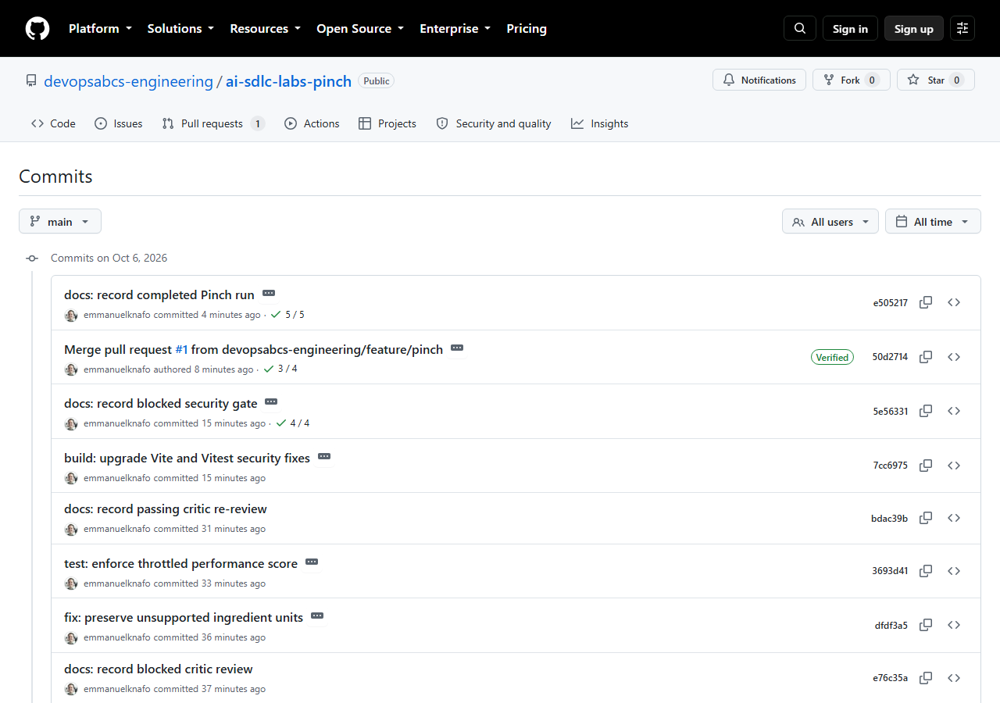
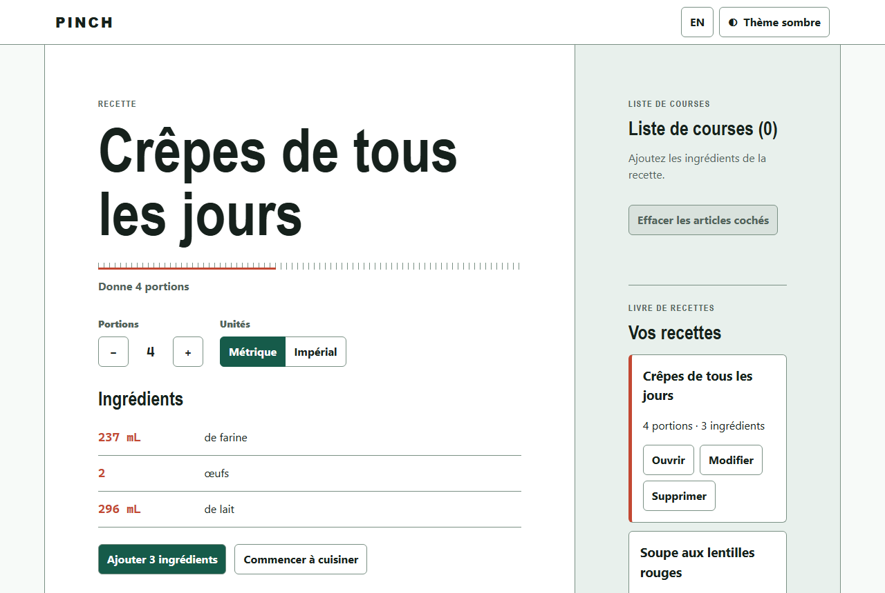
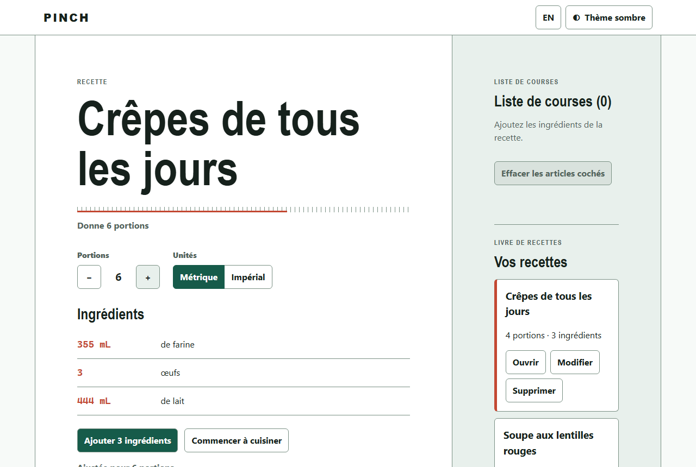
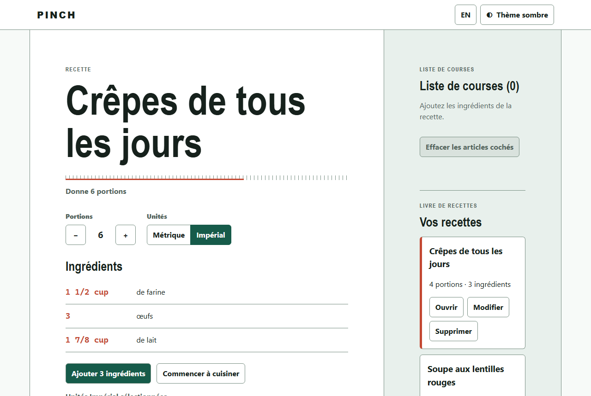
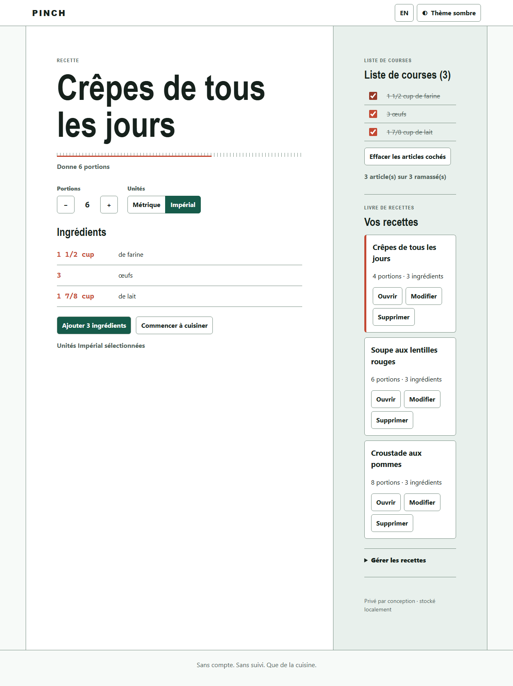
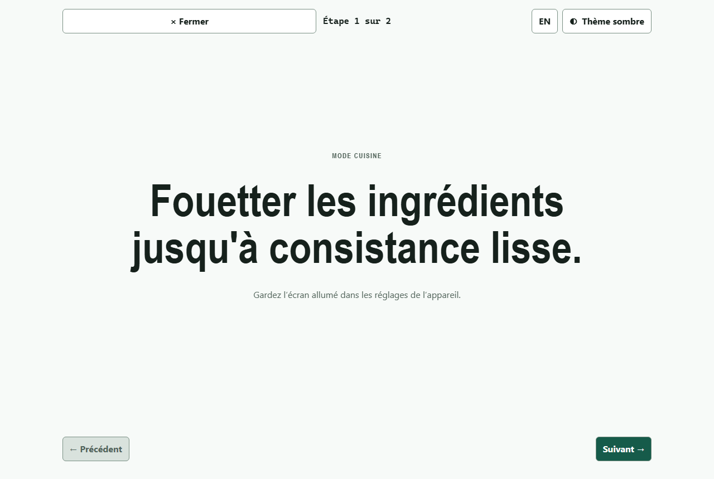
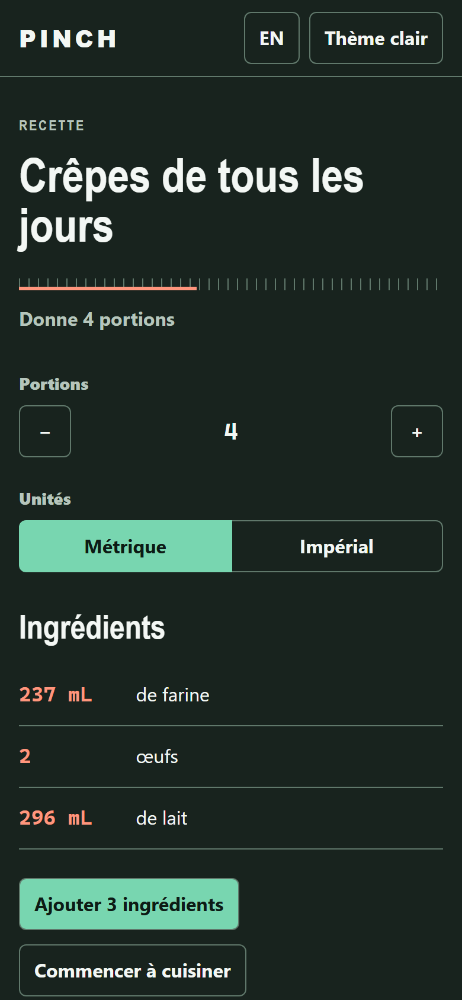

# Atelier 4 : Construction par tranches

<span class="chip phase-build"><span aria-hidden="true">🔨</span> Construction</span> <span class="chip phase-idea">60 min</span> <span class="chip phase-build">Intermédiaire</span>

## Présentation

<div class="lab-meta" markdown>

| Élément | Détails |
|---------|---------|
| **Durée** | 60 minutes |
| **Niveau** | Intermédiaire |
| **Prérequis** | [Atelier 3 : Exigences et architecture](lab-03-requirements-architecture.md) |
| **Point de contrôle** | Étiquette `lab-04-end` dans le dépôt de référence : toutes les tâches de construction sont terminées, chaque passerelle de construction a réussi, un commit par tâche. |
| **Atelier suivant** | [Atelier 5 : QA, revue critique et sécurité](lab-05-qa-critic-security.md) |

</div>

C'est ici que le code apparaît. Vous lancez deux phases de construction bornées. L'orchestrateur construit sept tranches, vérifie chacune avec les passerelles de l'atelier 3 et valide chacune dans un commit distinct.

## Objectifs d'apprentissage

À la fin de cet atelier, vous serez en mesure de :

* Lire comment l'orchestrateur découpe la spécification en tâches atomiques dans `state.json` et `tasks.md`.
* Lancer une phase de construction bornée et l'arrêter à une passerelle.
* Expliquer les passerelles `build`, `lint` et `unit` ainsi que les passerelles du projet `i18n-parity` et `portable-os`.
* Suivre la boîte de réception (inbox) et le scribe : comment les agents rendent compte sans modifier les fichiers partagés.
* Faire un commit par tâche pour qu'une mauvaise tâche soit facile à annuler.

## Coûts et crédits { #cost-and-credits }

!!! cost "L'atelier le plus coûteux jusqu'ici : environ 763 crédits et 48 minutes"
    La construction enregistrée a utilisé deux exécutions bornées :

    | Exécution | Tâches | Crédits | Durée |
    |-----------|--------|---------|-------|
    | `lab-04a-build-slices-1` | T-004 à T-007 | 394,17 | 28 min 39 s |
    | `lab-04b-build-slices-2` | T-008 à T-010 | 368,57 | 19 min 23 s |

    **Total : environ 763 crédits et 48 minutes de travail des agents.** Vous pouvez arrêter à la fin de n'importe quelle tranche avec `Ctrl+C` et reprendre plus tard. Pour économiser des crédits, suivez les commits enregistrés et passez directement au [point de contrôle](#checkpoint). Consultez l'[atelier 0](lab-00-setup.md#cost-and-credits) pour le portrait des coûts.

## Étapes

### Étape 1 : Vérifier le point de départ

Il vous faut la spécification de l'atelier 3 et Node.js de l'atelier 0.

```powershell
git status --short
node --version
$s = Get-Content .copilot-tracking\<run-id>\state.json -Raw | ConvertFrom-Json
$s.tasks | Where-Object { $_.id -match '^T-0(0[4-9]|10)$' } | Select-Object id, title, status
```

Remplacez `<run-id>` par le dossier de votre exécution (l'exécution enregistrée utilisait `2026-10-05-pinch`).

!!! success "Résultat attendu"
    L'arbre de travail est propre et les tâches T-004 à T-010 sont `pending`. L'énoncé exige que chaque script fonctionne sous Linux et sous Windows : utilisez une version LTS récente de Node.js.

### Étape 2 : Construire les quatre premières tranches

Lancez une seule phase bornée. L'invite dit à l'orchestrateur quoi faire pour chaque tâche et où s'arrêter.

```powershell
copilot -p "Use the ait-sdlc-orchestrate skill and resume the run. Run ONLY the build tasks T-004, T-005, T-006 and T-007, one at a time, in dependency order. For each task: dispatch ait-frontend-dev, then re-run the task's requiredGates yourself, record the result in state.json, archive the inbox handoff, and make one Conventional Commit. Stop after T-007. Do not push, do not deploy." --allow-all-tools --allow-all-paths --allow-all-urls --no-ask-user --share evidence\lab-04a-build-slices-1.md --log-dir evidence\logs
```

Vous pouvez aussi lancer `copilot` en mode interactif et coller la même invite. Dans VS Code, l'invite correspondante est `/product-implement`.

!!! warning "Laissez terminer la tranche"
    Si vous interrompez en plein milieu d'une tâche, `state.json` la garde à `in_progress`. À la reprise, l'orchestrateur la considère comme non terminée et la relance. C'est sans danger, mais vous payez la tranche deux fois.

!!! success "Résultat attendu"
    L'exécution se termine par quatre commits : `feat: scaffold bilingual app shell`, `feat: add quantity scaling and conversion`, `feat: add local recipe data management` et `feat: build responsive recipe scaler`.

### Étape 3 : Lire à quoi ressemble une tranche

Chaque tranche suit les mêmes sept gestes. C'est le travail de l'orchestrateur ; l'agent développeur ne fait qu'écrire le code.

1. Choisir la première tâche `pending` dont les dépendances sont `done`.
2. La marquer `in_progress` dans `state.json` et confier à `ait-frontend-dev` la tâche, ses critères d'acceptation et ses passerelles obligatoires.
3. Le développeur écrit le code et les tests, puis retourne un bloc de résultat et écrit **un seul** fichier dans la boîte de réception. Il ne modifie jamais `plan.md`, `tasks.md` ni `state.json`.
4. L'orchestrateur **relance lui-même les passerelles obligatoires**. Il ne se fie pas au rapport du développeur.
5. Il consigne chaque résultat dans `state.json` (`gateResults`) et ne marque la tâche `done` que si toutes les passerelles obligatoires sont `passed`.
6. Il archive le message de la boîte de réception dans `inbox\processed\` et met à jour `changes.md`.
7. Il fait **un seul** commit Conventional Commit.

Regardez les preuves après l'exécution :

```powershell
git log --oneline -8
Get-ChildItem .copilot-tracking\<run-id>\inbox\processed | Select-Object -Last 4 Name
$s = Get-Content .copilot-tracking\<run-id>\state.json -Raw | ConvertFrom-Json
$s.tasks | Where-Object { $_.id -match '^T-0(0[4-7])$' } | Select-Object id, status, retries
```

!!! success "Résultat attendu"
    Le journal montre un commit par tâche, `inbox\processed\` contient les messages archivés, et T-004 à T-007 sont `done`.

### Étape 4 : Lancer vous-même les passerelles

Les passerelles sont de simples scripts npm. Lancez les cinq que l'orchestrateur a lancées. Ne faites pas confiance à un rapport vert que vous n'avez pas vu passer au vert.

```powershell
npm ci
npm run build
npm run lint
npm test
npm run i18n-parity
npm run portable-os
```

!!! success "Résultat attendu"
    Chaque commande se termine sans erreur. À la fin de T-007, Vitest rapporte 65 tests unitaires et chaque catalogue de langue compte 61 clés.

!!! tip "La passerelle i18n"
    `npm run i18n-parity` aplatit `src/catalogs/en.json` et `src/catalogs/fr.json` et échoue si une clé est manquante, en trop ou vide. Supprimez une clé de `fr.json`, lancez la commande, voyez-la échouer, puis restaurez le fichier avec `git checkout src/catalogs/fr.json`.

### Étape 5 : Construire les trois dernières tranches

```powershell
copilot -p "Use the ait-sdlc-orchestrate skill and resume the run. Run ONLY the build tasks T-008, T-009 and T-010, one at a time, in dependency order. For each task: dispatch ait-frontend-dev, then re-run the task's requiredGates yourself, record the result in state.json, archive the inbox handoff, and make one Conventional Commit. Stop after T-010. Do not push, do not deploy." --allow-all-tools --allow-all-paths --allow-all-urls --no-ask-user --share evidence\lab-04b-build-slices-2.md --log-dir evidence\logs
```

Pour les vérifications dans le navigateur de T-010, installez une fois le Chromium propre à Playwright, puis lancez-les :

```powershell
npx playwright install chromium
npm run test:e2e
npm run test:lighthouse
```

!!! success "Résultat attendu"
    Trois commits de plus. À la fin, le dépôt compte 73 tests unitaires, 78 clés de catalogue par langue, 2 tests de bout en bout Playwright et une vérification de type Lighthouse dans le navigateur, tous réussis.

### Étape 6 : Passer en revue les sept tranches

| Tâche | Commit | Tranche | Tests unitaires | Clés de catalogue par langue |
|-------|--------|---------|----------------:|-----------------------------:|
| T-004 | `3ca36ef` | Structure de base de l'application bilingue | 5 | 18 |
| T-005 | `575e462` | Mise à l'échelle et conversion des quantités | 48 | inchangé |
| T-006 | `2ae8930` | Gestion locale des recettes et des données | 61 | 42 |
| T-007 | `219a8b9` | Outil de mise à l'échelle adaptatif | 65 | 61 |
| T-008 | `87cbef3` | Liste de courses persistante | 70 | 69 |
| T-009 | `d4542cf` | Mode cuisine accessible | 73 | 78 |
| T-010 | `5eeeda4` | PWA hors ligne et couverture dans le navigateur | 73 | 78 |

T-010 n'ajoute aucun test unitaire, mais apporte 2 tests de bout en bout Playwright et la vérification de type Lighthouse. Remarquez l'ordre : T-008 (liste de courses) et T-009 (mode cuisine) dépendent toutes deux de T-007, et non l'une de l'autre.

<figure class="screenshot-frame" markdown>

<figcaption>La liste des commits sur GitHub. Les commits les plus récents des ateliers suivants sont en haut ; faites défiler jusqu'aux sept commits `feat:` de cet atelier, un par tâche.</figcaption>
</figure>

### Étape 7 : Essayer l'application

```powershell
npm run dev
```

Ouvrez l'adresse locale que Vite affiche ; elle contient le chemin de base `/ai-sdlc-labs-pinch/`. Les captures ci-dessous proviennent de l'application en ligne. Comparez-les à ce que vous voyez : la recette pour quatre portions, puis six, puis en unités impériales, puis le mode cuisine.

<figure class="screenshot-frame" markdown>

<figcaption>Le point de départ : 4 portions, en métrique. Regardez les trois quantités : 237 mL de farine, 2 œufs, 296 mL de lait.</figcaption>
</figure>

<figure class="screenshot-frame" markdown>

<figcaption>Portions réglées à 6. Chaque quantité est multipliée par 6 divisé par 4, comme l'exige l'exigence R2.</figcaption>
</figure>

<figure class="screenshot-frame" markdown>

<figcaption>Unités impériales. Les quantités s'affichent en fractions courantes (1 1/2 cup, 1 7/8 cup) ; les œufs restent un nombre.</figcaption>
</figure>

<figure class="screenshot-frame" markdown>

<figcaption>La liste de courses avec les trois articles cochés. Vérifiez le compteur : 3 article(s) sur 3 ramassé(s).</figcaption>
</figure>

<figure class="screenshot-frame" markdown>

<figcaption>Le mode cuisine : une grande étape à la fois, avec des commandes Précédent et Suivant.</figcaption>
</figure>

<figure class="screenshot-frame" markdown>

<figcaption>La même recette sur un téléphone, en français et en thème sombre. Regardez le bouton de langue (EN) et le bouton de thème (Thème clair) : l'écran a changé de langue et de thème sans perdre la recette.</figcaption>
</figure>

## Point de contrôle { #checkpoint }

Le point de contrôle est l'étiquette `lab-04-end` (commit `5eeeda4`) du dépôt [ai-sdlc-labs-pinch](https://github.com/devopsabcs-engineering/ai-sdlc-labs-pinch).

```powershell
git diff lab-04-start lab-04-end --stat
git log lab-04-start..lab-04-end --oneline
git checkout lab-04-end
npm ci; npm test
```

!!! checkpoint "Ce que vous devriez voir"
    Le diff indique 31 fichiers modifiés et 7 486 insertions (il comprend `package-lock.json`). Le journal liste exactement les sept commits `feat:` du tableau. `npm test` rapporte 73 tests. Revenez à votre branche avec `git switch -`.

## Apportez votre propre idée

Même déroulement, avec votre propre spécification de l'atelier 3.

* [ ] Gardez 3 ou 4 fonctionnalités et de 5 à 7 tranches. Les crédits augmentent avec chaque tranche.
* [ ] Une tranche, une tâche, un commit, un ensemble de passerelles obligatoires.
* [ ] Lancez au plus trois ou quatre tranches par appel `copilot -p` et terminez l'invite par `Stop after T-0NN`.
* [ ] Figez les dépendances à des versions exactes et validez `package-lock.json` avec des URL `registry.npmjs.org`.
* [ ] Ajoutez une passerelle propre au projet pour toute règle qui vous tient à cœur, sous forme d'un script que l'orchestrateur peut lancer.
* [ ] Relancez vous-même les passerelles avant de passer à l'atelier suivant.

## Ce qui a mal tourné dans l'exécution enregistrée

* **Une commande de passerelle qui n'existait pas.** La première commande complète de l'orchestrateur utilisait `npm run check:i18n`. Le script s'appelle `i18n-parity`. L'orchestrateur a remarqué l'erreur et relancé le bon script. La leçon : la commande d'une passerelle fait partie de la spécification, alors nommez les scripts dans l'ADR.
* **T-010 n'était vert que sous Windows.** L'orchestrateur a vérifié lui-même le câblage multiplateforme et fait ajouter par le développeur un workflow réservé aux tests, `cross-platform-tests.yml`, qui s'exécute sur `ubuntu-latest` et `windows-latest` et utilise `chromium.executablePath()` sans chemin de navigateur codé en dur.
* **Le scribe n'a pas pu consolider.** Le sous-agent scribe n'a pas d'outil de lecture ; l'orchestrateur a donc fusionné lui-même les messages de la boîte de réception. C'est une limite connue du plugin, pas un problème de votre installation.

## Dépannage

### Une passerelle échoue avec `Missing script`

Ouvrez `package.json` et comparez les noms de scripts aux noms des passerelles. Dans Pinch, la passerelle i18n est `i18n-parity`. Demandez à l'orchestrateur de corriger sa commande, pas vos scripts.

### `npm ci` ou l'intégration continue échoue sur des URL de registre

Derrière un proxy npm d'entreprise, le fichier de verrouillage peut enregistrer des URL de proxy qui font échouer l'intégration continue. Vérifiez que chaque URL `resolved` pointe vers `registry.npmjs.org` :

```powershell
(Select-String -Path package-lock.json -Pattern '"resolved"' | Where-Object { $_.Line -notmatch 'registry\.npmjs\.org' }).Count
```

Le décompte doit être `0`. Sinon, exécutez `npm config set registry https://registry.npmjs.org/` et régénérez le fichier de verrouillage.

### Les tests du navigateur ne trouvent pas Chromium

Exécutez une fois `npx playwright install chromium`. Dans l'intégration continue sous Linux, utilisez `npx playwright install --with-deps chromium`. Les tests n'utilisent que le Chromium fourni avec Playwright.

### L'exécution s'est arrêtée au milieu d'une tranche

Reprenez avec : `Use the ait-sdlc-orchestrate skill and resume the run. Continue with the first unfinished build task and stop after T-0NN.` Les tâches terminées ne sont jamais refaites.

## Vérification des connaissances

??? question "Pourquoi l'orchestrateur relance-t-il les passerelles au lieu de se fier au développeur ?"
    Le développeur est l'auteur du code : son rapport est une affirmation, pas une preuve. Une nouvelle exécution indépendante transforme l'affirmation en un résultat consigné dans `state.json`.

??? question "Pourquoi un commit par tâche ?"
    Une mauvaise tâche devient un seul commit que vous pouvez annuler, et la liste des commits se lit comme le carnet de tâches.

## Résumé

Vous avez construit Pinch en sept tranches : 73 tests unitaires, 78 clés de catalogue par langue, 2 tests de bout en bout et une vérification de la qualité dans le navigateur, chaque tranche vérifiée par des passerelles et validée une seule fois. Les deux exécutions ont coûté environ 763 crédits.

## Prochaines étapes

Poursuivez avec l'[atelier 5 : QA, revue critique et sécurité](lab-05-qa-critic-security.md), où des agents indépendants essaient de casser ce que vous venez de construire.
