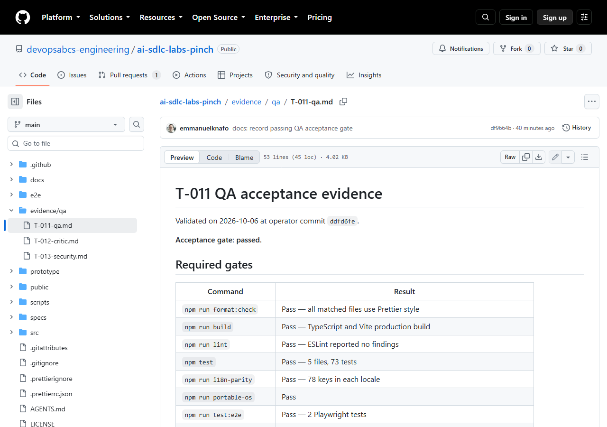
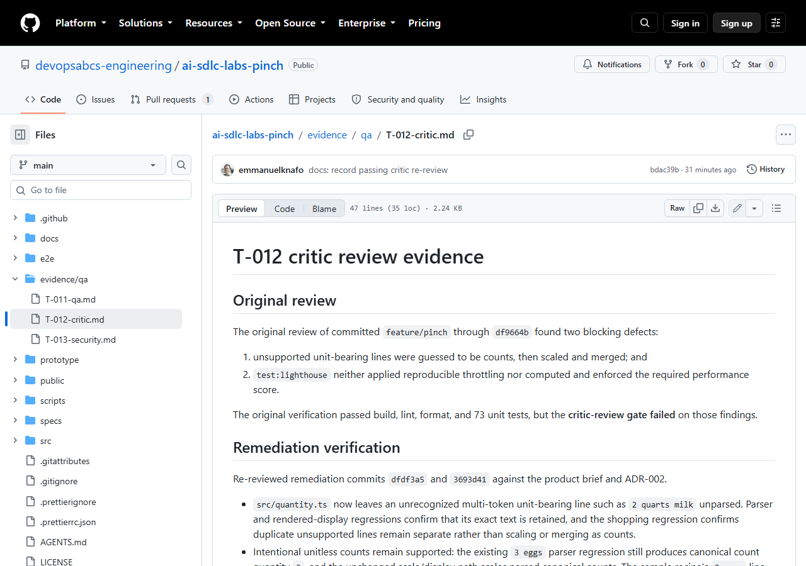
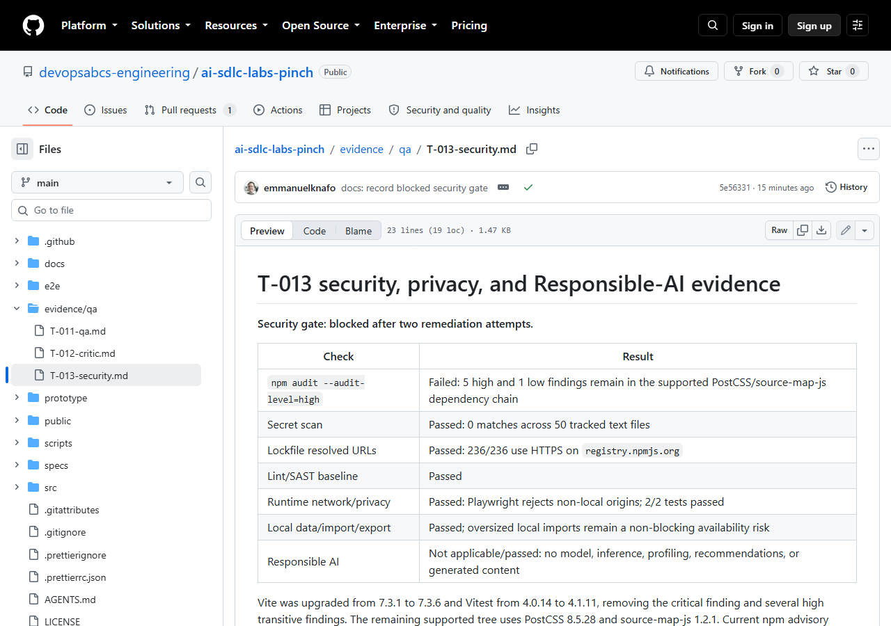

# Atelier 5 : QA, revue critique et sécurité

<span class="chip phase-test"><span aria-hidden="true">✅</span> Tests</span> <span class="chip phase-idea">45 min</span> <span class="chip phase-build">Intermédiaire</span>

## Présentation

<div class="lab-meta" markdown>

| Élément | Détails |
|---------|---------|
| **Durée** | 45 minutes |
| **Niveau** | Intermédiaire |
| **Prérequis** | [Atelier 4 : Construction par tranches](lab-04-build-in-slices.md) |
| **Point de contrôle** | Étiquette `lab-05-end` dans le dépôt de référence : l'acceptation et la revue critique ont réussi, et la passerelle de sécurité est bloquée sur un constat que seul un humain peut trancher (la dérogation est l'objet de l'atelier 6). |
| **Atelier suivant** | [Atelier 6 : Approbation humaine et modifications demandées](lab-06-signoff-changes-requested.md) |

</div>

La construction est terminée et tout est vert. Trois tâches de la phase de tests vérifient maintenant le produit de l'extérieur : la QA (`T-011`), la revue critique (`T-012`) et la sécurité (`T-013`). Dans l'exécution enregistrée, **chacune a trouvé un vrai problème**, et deux ont arrêté l'exécution. C'est la leçon de cet atelier.

## Objectifs d'apprentissage

À la fin de cet atelier, vous serez en mesure de :

* Lancer la validation d'acceptation avec `ait-qa-validation` et lire les preuves.
* Lancer `ait-review-critic` et `ait-security`, et lire un constat bloquant.
* Voir une passerelle échouer, puis être corrigée par l'agent responsable avec une reprise comptabilisée.
* Expliquer pourquoi une tâche `blocked` après deux reprises est un comportement correct, et non un défaut.
* Débloquer une tâche en tant qu'opérateur, avec un petit commit révisé et une décision consignée.
* Reconnaître une « correction » qui affaiblit une passerelle, et la refuser.

## Coûts et crédits { #cost-and-credits }

!!! cost "Deux exécutions, environ 476 crédits"
    Le travail enregistré a été fait en deux exécutions. La première (`lab-05-qa-critic-security`) a consommé **79,25 crédits** et s'est arrêtée à la première passerelle bloquée. Après le déblocage par l'opérateur, la seconde (`lab-05b-qa-critic-security-retry`) a consommé **396,72 crédits** et duré 32 minutes 54 secondes. **Total : environ 476 crédits.**

    Vous n'avez pas besoin de tout relancer pour apprendre cet atelier. Lisez les preuves validées dans `evidence/qa/` et utilisez les étiquettes `lab-05-start` et `lab-05-end`. Consultez l'[atelier 0](lab-00-setup.md#cost-and-credits) pour les conseils généraux sur les coûts.

## Étapes

### Étape 1 : Partir du point de contrôle

Utilisez votre propre dépôt de l'atelier 4, ou le dépôt de référence à l'étiquette `lab-05-start` (le même commit que `lab-04-end`, `5eeeda4`).

```powershell
git clone https://github.com/devopsabcs-engineering/ai-sdlc-labs-pinch
Set-Location -LiteralPath ai-sdlc-labs-pinch
git checkout lab-05-start
npm ci
```

!!! success "Résultat attendu"
    `npm ci` se termine sans erreur. `git log --oneline -n 1` affiche `5eeeda4 feat: add offline PWA browser coverage`.

### Étape 2 : Lancer la phase de tests

Lancez **uniquement** la phase de tests, et demandez à l'orchestrateur de ne rien pousser ni déployer. Démarrez `copilot` à la racine du dépôt. Remplacez l'identifiant d'exécution par le vôtre s'il est différent.

```powershell
copilot -p "Use the ait-sdlc-orchestrate skill to resume run 2026-10-05-pinch. Run ONLY the Test phase: add tasks for QA (ait-qa-validation), critic review (ait-review-critic) and security (ait-security). Also write .github/workflows/pages.yml as a manual workflow_dispatch with a governance_approved input, but do not run it. Stop at any blocked gate. Do not push, do not deploy." --allow-all-tools --allow-all-paths --allow-all-urls --no-ask-user --share evidence\lab-05-qa-critic-security.md --log-dir evidence\logs
```

L'autre option, en mode interactif : lancez `copilot`, collez le même texte sans les options, et répondez vous-même à chaque demande d'autorisation.

L'exécution ajoute `T-011` (QA), `T-012` (revue critique) et `T-013` (sécurité) à `state.json`. Elle écrit aussi le workflow Pages : un `workflow_dispatch` manuel avec une entrée booléenne `governance_approved`, un job de vérifications de qualité, un artefact Pages immuable construit avec `--base=/ai-sdlc-labs-pinch/`, et `deploy-pages`. Elle **n'exécute pas** le workflow.

!!! success "Résultat attendu"
    Le fichier du workflow existe, et l'exécution se termine par un arrêt à la tâche de QA. Dans l'exécution enregistrée, `T-011` a été marquée `blocked` (étape suivante).

### Étape 3 : Lire une tâche bloquée

La QA a trouvé un vrai écart d'acceptation : l'exigence R8.1 du PRD demande Prettier, mais le dépôt n'avait **aucune passerelle de formatage**. L'agent a essayé de l'ajouter :

```powershell
npm install --save-dev prettier
```

La politique du registre d'entreprise l'a refusé :

```text
npm error EALLOWREMOTE "Fetching packages of type remote have been disabled"
```

L'URL de l'archive passant par le proxy diffère de `registry.npmjs.org`, donc npm a refusé le paquet. Après deux échecs, l'orchestrateur a marqué la tâche comme bloquée et s'est arrêté. Vérifiez l'état :

```powershell
# Votre propre exécution : .copilot-tracking\<run-id>\state.json (ignoré par Git)
$s = Get-Content .copilot-tracking\2026-10-05-pinch\state.json -Raw | ConvertFrom-Json
$s.tasks | Where-Object { $_.id -in 'T-011','T-012','T-013' } | Select-Object id, owner, status, retries
```

!!! success "Résultat attendu"
    Dans votre exécution, `T-011` affiche `blocked` avec `retries` à 2. C'est **correct** : la règle des reprises en permet deux, puis la tâche s'arrête et un humain décide.

!!! tip "Vous lisez seulement le dépôt de référence ?"
    Le registre de suivi est ignoré par Git : un clone ne le contient pas. L'instantané final est validé sur `main` : `git show main:docs/run/2026-10-05-pinch/state.json`. Il montre la fin de l'exécution (toutes les tâches `done`), avec les reprises suivantes : `T-011` 0, `T-012` 1 et `T-013` 2.

!!! warning "L'agent ne doit pas affaiblir la passerelle"
    La solution de facilité serait de supprimer l'exigence Prettier, de sauter la passerelle ou de pointer npm vers une autre source. Une passerelle dont l'outillage ne peut pas s'exécuter est **bloquée**, jamais ignorée en silence. Ici, aucune dérogation n'était nécessaire : la solution était de fournir correctement le paquet.

### Étape 4 : La débloquer en tant qu'opérateur

Cette étape est une action humaine, pas une invite d'agent. L'objectif est d'ajouter `prettier@3.9.9` avec une URL de registre **canonique** et le vrai hachage d'intégrité, sans passer par le chemin du proxy bloqué.

1. Demandez au registre le hachage d'intégrité de la version exacte :

    ```powershell
    npm view prettier@3.9.9 dist.integrity
    ```

2. Dans `package.json`, ajoutez `"prettier": "3.9.9"` à `devDependencies` (version exacte, comme toutes les autres dépendances).
3. Dans `package-lock.json`, ajoutez `"prettier": "3.9.9"` aux `devDependencies` du paquet racine, puis ajoutez une entrée `node_modules/prettier` avec `"version": "3.9.9"`, une valeur `resolved` de `https://registry.npmjs.org/prettier/-/prettier-3.9.9.tgz` et la valeur `sha512-...` de l'étape 1 comme `integrity`.
4. Prouvez que le fichier de verrouillage et `package.json` concordent :

    ```powershell
    npm ci
    ```

5. Ajoutez les scripts de formatage, la configuration et les vérifications des pipelines :
    * Scripts de `package.json` : `"format": "prettier --write ."` et `"format:check": "prettier --check ."`.
    * `.prettierrc.json` : `{ "endOfLine": "auto" }`.
    * `.prettierignore` : les dossiers générés et de preuves, comme `dist`, `node_modules`, `package-lock.json`, `evidence` et `.copilot-tracking`.
    * `.gitattributes` : `* text=auto eol=lf`, pour que les exécuteurs Windows n'échouent pas à la vérification du format à cause des fins de ligne CRLF.
    * Les deux workflows (`pages.yml` et `cross-platform-tests.yml`) : une étape qui exécute `npm run format:check`.
6. Formatez tout le dépôt une fois, vérifiez, puis validez :

    ```powershell
    npm run format
    npm ci
    npm run format:check
    git add -A
    git commit -m "build: add Prettier format gate and format the repository"
    ```

!!! tip "Si votre registre fonctionne"
    Sur un réseau sans cette politique, `npm install --save-dev --save-exact prettier@3.9.9` fait les étapes 1 à 4 à votre place. La voie manuelle est destinée aux registres verrouillés.

!!! success "Résultat attendu"
    `npm ci` et `npm run format:check` se terminent tous deux sans erreur. Le commit enregistré est `ddfd6fe`, inclus dans l'étiquette `lab-05-end`.

!!! checkpoint "Consigner le déblocage"
    Un déblocage par l'opérateur n'est pas une modification silencieuse. La seconde exécution l'a consigné dans `decisions.md` sous l'ADR-013 « Accept the operator Prettier unblock », a remis `T-011` à `pending` avec zéro reprise, et lui a donné un nouveau budget de deux reprises.

### Étape 5 : Reprendre et lire le résultat de la QA

```powershell
copilot -p "Use the ait-sdlc-orchestrate skill to resume run 2026-10-05-pinch. The operator unblocked T-011 with commit ddfd6fe: record that decision, reset T-011 to pending with retries 0, then run T-011, T-012 and T-013 in order. Stop at any blocked gate. Do not push, do not deploy." --allow-all-tools --allow-all-paths --allow-all-urls --no-ask-user --share evidence\lab-05b-qa-critic-security-retry.md --log-dir evidence\logs
```

`T-011` relance toute la suite d'acceptation et écrit `evidence/qa/T-011-qa.md`. Pour le lire sans rien exécuter, faites d'abord `git checkout lab-05-end`.

```powershell
Get-Content evidence\qa\T-011-qa.md | Select-Object -First 25
```

<figure class="screenshot-frame" markdown>

<figcaption>Le fichier de preuves de la QA. Regardez le tableau des passerelles obligatoires : format, build, lint, tests unitaires, parité i18n, portable-os et Playwright réussissent tous une fois la passerelle Prettier en place.</figcaption>
</figure>

!!! success "Résultat attendu"
    Le fichier indique `Acceptance gate: passed`. Les 24 critères numérotés du PRD sont rattachés à des tests : format, build, lint, 73 tests unitaires répartis dans 5 fichiers, parité i18n (78 clés dans chaque langue), `portable-os`, 2 tests Playwright et la vérification de type Lighthouse.

Un test Playwright s'est figé une fois au démarrage à froid et a été arrêté après plus de 270 secondes. La réexécution à l'identique a réussi en 7,4 secondes. L'agent n'a modifié ni le test ni le délai d'expiration, et il a consigné l'incident dans les preuves.

### Étape 6 : Lire les constats bloquants de la revue critique

`T-012` est confiée à un autre agent (`ait-code-reviewer`), qui lit le code et les preuves, pas seulement la sortie des tests. La tâche a **d'abord échoué**, avec deux défauts bloquants que tous les tests avaient manqués :

1. Une ligne dont l'unité est inconnue et composée de plusieurs mots, comme `2 quarts milk`, était interprétée comme un dénombrement, puis mise à l'échelle et fusionnée. Elle doit rester inchangée et non fusionnée. Un dénombrement sans unité comme `3 eggs` doit toujours être mis à l'échelle.
2. `test:lighthouse` n'appliquait pas de limitation reproductible et ne faisait pas respecter la note de performance exigée par le PRD (au moins 0,9).

L'agent développeur les a corrigés en deux commits : `dfdf3a5` (« fix: preserve unsupported ingredient units ») et `3693d41` (« test: enforce throttled performance score »). La nouvelle revue n'a relancé que la passerelle en échec et les tests les plus pertinents.

<figure class="screenshot-frame" markdown>

<figcaption>Les preuves de la revue critique. Lisez la section « Original review » : deux défauts bloquants, et la phrase qui indique que la passerelle critic-review a échoué alors que le build, le lint, le format et 73 tests unitaires avaient réussi.</figcaption>
</figure>

!!! success "Résultat attendu"
    Le fichier se termine par « The T-012 critic-review gate passes ». La note de performance avec limitation est de 1,000 pour un minimum de 0,900. Dans `state.json`, `T-012` affiche `retries: 1`.

### Étape 7 : Lire le résultat de la sécurité

`T-013` (`ait-security-rai`) a lancé l'audit des dépendances en ligne et **a échoué** : 1 constat critique et 6 constats élevés. La mise à niveau de Vite vers 7.3.6 et de Vitest vers 4.1.11 (commit `7cc6975`) a éliminé le constat critique et plusieurs constats élevés. Cinq constats élevés sont restés, tous dans une même chaîne :

```text
vite -> postcss -> source-map-js 1.2.1   (GHSA-68fv-2mgg-jv7q, corrigé en 1.2.2, pas encore publié)
```

Le correctif suggéré par l'audit aurait rétrogradé Vite vers 2.7.3 et Vitest vers 0.0.122. L'agent l'a **refusé**, car cela aurait cassé la chaîne d'outils prise en charge juste pour faire taire un rapport. Les autres vérifications ont réussi : 0 secret trouvé dans 50 fichiers suivis, 236 URL sur 236 du fichier de verrouillage sur `registry.npmjs.org`, aucune requête inter-origines, et IA responsable sans objet (aucun modèle ni contenu généré). Après deux reprises, `T-013` a été bloquée.

<figure class="screenshot-frame" markdown>

<figcaption>Les preuves de sécurité. Regardez la première ligne (bloquée après deux tentatives de correction) et la seule ligne en échec, l'audit des dépendances, à côté de l'analyse des secrets et des vérifications du fichier de verrouillage qui ont réussi.</figcaption>
</figure>

!!! success "Résultat attendu"
    `T-013` est `blocked` avec `retries: 2`, et l'exécution s'arrête. Aucun agent ne lève ce blocage. La décision revient à une personne : voir l'[atelier 6](lab-06-signoff-changes-requested.md).

## Point de contrôle

Comparez votre résultat avec le dépôt de référence.

```powershell
git fetch --tags
git log --oneline lab-05-start..lab-05-end
```

* L'étiquette `lab-05-end` correspond au commit `5e56331` (« docs: record blocked security gate »).
* L'historique entre les deux étiquettes comprend le workflow `95c8cee`, la passerelle Prettier `ddfd6fe`, les correctifs de la revue critique `dfdf3a5` et `3693d41`, et la mise à niveau des dépendances `7cc6975`.
* `evidence/qa/` contient `T-011-qa.md`, `T-012-critic.md` et `T-013-security.md`.
* Dans votre registre de suivi, `T-011` et `T-012` sont `done` et `T-013` est `blocked`.

## Apportez votre propre idée

La phase de tests fonctionne de la même façon pour n'importe quelle application. Lancez-la sur votre propre dépôt et vérifiez que :

* [ ] Votre énoncé a des critères d'acceptation mesurables (le PRD de l'atelier 3), pour que la QA ait quelque chose à tracer.
* [ ] Vous lancez la QA, la revue critique et la sécurité en une seule exécution bornée, avec « stop at any blocked gate, do not push, do not deploy ».
* [ ] Vous lisez vous-même `evidence/` avant de faire confiance à un résultat vert.
* [ ] Vous n'acceptez jamais une correction qui supprime une vérification, saute une passerelle ou rétrograde un outil vers une version non prise en charge.
* [ ] Chaque déblocage par l'opérateur est un petit commit accompagné d'une décision, et la tâche est remise à `pending` avec zéro reprise.

## Ce qui s'est mal passé dans l'exécution enregistrée

Rien ici n'est une erreur de l'atelier. Voilà à quoi ressemble une vraie exécution avec passerelles.

### Le premier blocage venait de l'environnement, pas du code

L'écart Prettier était réel, mais l'installation a échoué à cause de la politique du registre (`EALLOWREMOTE`). Après deux tentatives, `T-011` a été bloquée et l'exécution s'est arrêtée. L'opérateur a corrigé la cause à la main (étape 4) et l'a consignée.

### Les tests étaient verts et la revue critique a quand même échoué

73 tests unitaires réussissaient, mais aucun ne vérifiait que « les unités inconnues restent inchangées », et aucune vérification n'imposait la note de performance. La revue critique a trouvé les deux en lisant le code à la lumière de l'énoncé et des ADR. Des tests verts ne prouvent que ce que les tests vérifient.

### Un test instable a été signalé, pas caché

Un test Playwright s'est figé au démarrage à froid. L'agent n'a pas augmenté le délai d'expiration. Il a arrêté l'exécution, relancé exactement la même commande, obtenu un succès en 7,4 secondes et consigné les deux faits dans les preuves.

### Le dernier blocage n'avait pas de correctif

Les constats élevés restants n'avaient aucun correctif publié, et une rétrogradation forcée a été refusée. `T-013` est restée bloquée et a été remontée à un humain. Dans l'état final de l'exécution, les reprises sont de 0 pour `T-011`, 1 pour `T-012` et 2 pour `T-013`.

## Dépannage

### `npm install` échoue avec `EALLOWREMOTE`

Votre registre ou votre proxy réécrit les URL des archives. Utilisez la voie manuelle de l'étape 4 avec l'URL canonique `https://registry.npmjs.org/`, et vérifiez avec `npm ci`. Ne validez pas un fichier de verrouillage qui pointe vers un registre privé.

### L'agent relance sans cesse la même commande en échec

Arrêtez-le avec `Ctrl+C`. La règle est de deux reprises comptabilisées, puis `blocked`. Si une tâche reste `in_progress` après un plantage, une reprise la considère comme non terminée et la relance.

### `format:check` échoue sous Windows mais pas sous Linux

Ce sont les fins de ligne. Vérifiez que `.gitattributes` contient `* text=auto eol=lf`, puis exécutez `git add --renormalize .` et `npm run format`.

### `npm audit fix --force` est suggéré

Lisez ce qu'il modifie avant toute chose. S'il rétrograde un outil majeur (ici Vite 7 vers 2.7.3), ne l'appliquez pas. Consignez le constat et laissez un humain décider.

## Vérification des connaissances

??? question "Pourquoi `blocked` après deux reprises est-il le bon résultat ?"
    La règle des reprises donne deux tentatives comptabilisées à un agent. Si une passerelle ne peut toujours pas réussir, la cause dépasse ce que l'agent devrait changer seul, comme une politique de registre ou un correctif amont manquant. S'arrêter confie la décision à une personne. Continuer reviendrait à affaiblir une passerelle.

??? question "Que doit faire l'opérateur après avoir débloqué une tâche ?"
    Consigner le déblocage comme une décision (ici l'ADR-013), et remettre la tâche à `pending` avec `retries` à 0 pour qu'elle obtienne un nouveau budget.

??? question "La revue critique a échoué alors que tous les tests réussissaient. A-t-elle tort ?"
    Non. Les tests ne vérifiaient pas le comportement manquant. La revue critique a comparé le code à l'énoncé et trouvé deux défauts, ensuite corrigés et couverts par des tests de non-régression.

## Résumé

* La QA, la revue critique et la sécurité ont chacune trouvé un vrai problème : une passerelle de formatage manquante, une mauvaise gestion des unités inconnues, une vérification de performance absente et une chaîne de dépendances vulnérable.
* Une passerelle qui ne peut pas s'exécuter ou réussir est `blocked`. Un agent ne la saute, ne l'assouplit et ne la supprime jamais.
* L'opérateur débloque avec un petit commit révisable (`ddfd6fe`) et une décision consignée.
* La passerelle de sécurité reste bloquée parce qu'aucun correctif n'existe. Un humain, et non un agent, décide de la suite.

## Prochaines étapes

Poursuivez avec l'[atelier 6 : Approbation humaine et modifications demandées](lab-06-signoff-changes-requested.md), où vous répondez à la question de la dérogation et approuvez le commit exact.
