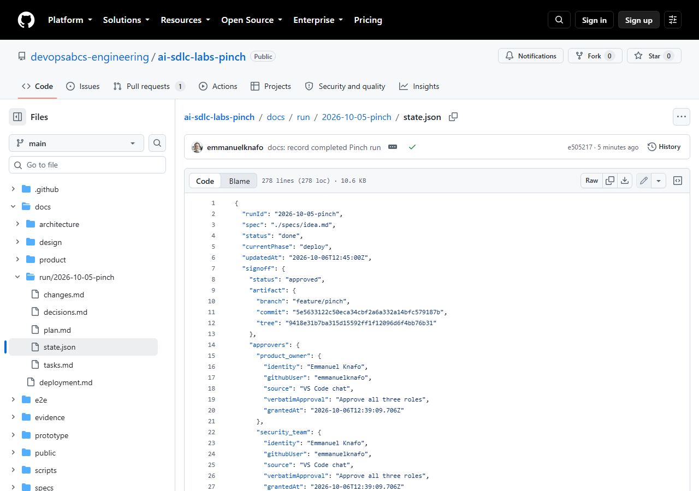
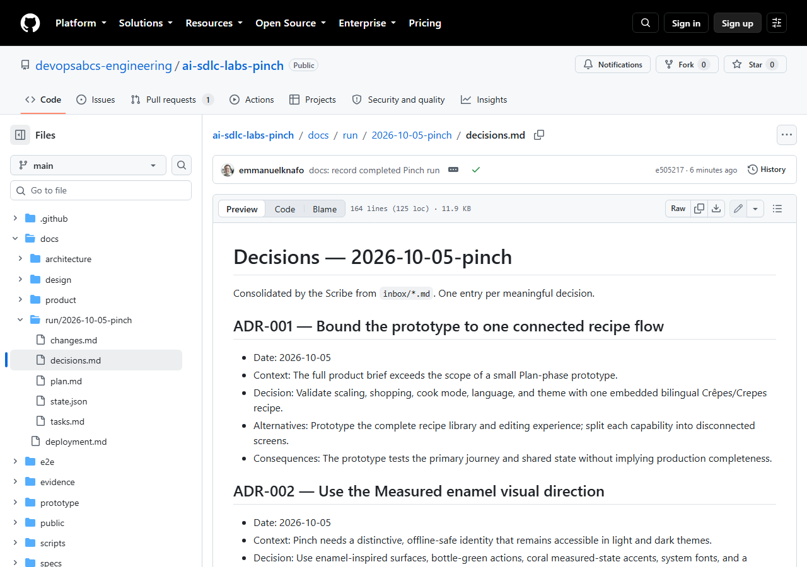

# Atelier 6 : Approbation humaine et modifications demandées

<span class="chip phase-sign"><span aria-hidden="true">🔐</span> Approbation</span> <span class="chip phase-idea">30 min</span> <span class="chip phase-build">Intermédiaire</span>

## Présentation

<div class="lab-meta" markdown>

| Élément | Détails |
|---------|---------|
| **Durée** | 30 minutes |
| **Niveau** | Intermédiaire |
| **Prérequis** | [Atelier 5 : QA, revue critique et sécurité](lab-05-qa-critic-security.md) |
| **Point de contrôle** | Étiquette `lab-06-end` dans le dépôt de référence : l'approbation est accordée par les trois rôles d'approbateur, ou la boucle de modifications demandées est terminée. `lab-06-start` et `lab-06-end` désignent le même commit, `5e56331`, parce que les décisions se trouvent dans l'état de suivi, pas dans le code. |
| **Atelier suivant** | [Atelier 7 : Déploiement en production](lab-07-deploy.md) |

</div>

La passerelle de sécurité de l'atelier 5 est bloquée et rien n'a été déployé. Il reste deux décisions, qui reviennent à une personne : que faire du constat bloqué, et faut-il approuver ce commit exact. **L'agent pose la question. Une personne répond. La réponse est consignée mot pour mot.** C'est toute la passerelle humaine.

## Objectifs d'apprentissage

À la fin de cet atelier, vous serez en mesure de :

* Lire un dossier d'approbation : ce qui a été construit, les passerelles, les décisions, les risques et le commit exact.
* Tenir les trois rôles d'approbateur (responsable produit, équipe de sécurité, responsable technique) lorsque vous êtes seul.
* Consigner une dérogation avec un motif et un déclencheur de réévaluation.
* Lire le registre d'approbation dans `state.json` et dans `decisions.md`.
* Expliquer pourquoi tout changement après l'approbation la réinitialise et renvoie le travail en construction.
* Énumérer ce que les agents ne doivent jamais faire : approuver à votre place, pousser ou déployer avant l'approbation.

## Coûts et crédits { #cost-and-credits }

!!! cost "Presque gratuit si vous suivez l'exécution enregistrée"
    L'approbation enregistrée faisait partie d'une seule exécution, `lab-06-07-signoff-deploy`, qui couvrait aussi le déploiement de l'atelier 7 : **117,52 crédits** et 8 minutes 52 secondes pour les deux. Les questions elles-mêmes coûtent très peu. L'exemple de modifications demandées s'appuie sur les preuves de Focus Garden : vous ne relancez donc **pas** une seconde construction (son exécution 3 a duré environ 57 minutes et consommé 747 crédits). Consultez l'[atelier 0](lab-00-setup.md#cost-and-credits) pour les conseils généraux sur les coûts.

## Étapes

### Étape 1 : Partir du point de contrôle

```powershell
git clone https://github.com/devopsabcs-engineering/ai-sdlc-labs-pinch
Set-Location -LiteralPath ai-sdlc-labs-pinch
git checkout lab-06-start
git rev-parse HEAD
git rev-parse 'HEAD^{tree}'
```

!!! success "Résultat attendu"
    Le commit est `5e5633122c50eca34cbf2a6a332a14bfc579187b` et l'arbre (tree) est `9418e31b7ba315d15592ff1f12096d6f4bb76b31`. Gardez ces deux valeurs : elles identifient ce que vous allez approuver.

### Étape 2 : Laisser l'agent présenter le dossier et poser ses questions

Lancez l'orchestrateur en mode **interactif**, pour qu'il puisse vous poser des questions. N'utilisez pas `--no-ask-user` ici : l'agent doit pouvoir demander, et vous devez pouvoir répondre.

```powershell
copilot
```

Collez ensuite l'invite (dans VS Code, le même texte fonctionne dans le clavardage) :

```text
Use the ait-sdlc-orchestrate skill to resume run 2026-10-05-pinch. Run ONLY the human sign-off gate. Present the sign-off package: what was built, the gate results, the decisions and risks, and the exact commit and tree. Ask me each question, record my answers verbatim in decisions.md and state.json, and stop. Do not fill in the approvers yourself. Do not push, do not deploy.
```

!!! warning "L'agent ne s'approuve jamais lui-même"
    Si l'agent écrit `approved` sans vous interroger, ou remplit lui-même les approbateurs, rejetez le résultat et arrêtez l'exécution. L'énoncé de Pinch le dit explicitement : s'arrêter à l'approbation et ne pas renseigner les approbateurs.

### Étape 3 : Répondre à la question 1, la dérogation

Dans l'exécution enregistrée, la première question était de déroger ou non au constat `npm audit` limité au développement, qui bloquait `T-013`. Avant de répondre, vérifiez l'argument vous-même :

```powershell
npm audit --omit=dev --audit-level=high
```

La réponse enregistrée a été **« Waive and continue »** (déroger et continuer), pour ces raisons :

* Le constat restant `source-map-js < 1.2.2` se trouve dans l'outillage de développement (`vite` -> `postcss` -> `source-map-js`), et aucune version corrigée n'existe.
* Pinch n'a **aucune dépendance d'exécution**, et `npm audit --omit=dev --audit-level=high` signale 0 vulnérabilité.
* Le seul « correctif » automatique rétrograderait Vite et Vitest vers de vieilles versions.

Une dérogation n'est acceptable qu'avec les quatre éléments ci-dessous. Voici l'entrée réelle (ADR-017) que le scribe a écrite à partir de la réponse, abrégée (les lignes de date et de conséquences sont omises) :

```markdown
## ADR-017 — Human waiver for the development-only source-map-js advisory

- Human: Emmanuel Knafo (`emmanuelknafo`)
- Source: VS Code chat
- Verbatim answer: "Waive and continue"
- Context: The remaining `source-map-js <1.2.2` npm audit finding is development-only, no fixed
  release exists, the application has zero runtime dependencies, and
  `npm audit --omit=dev --audit-level=high` reports zero vulnerabilities.
- Decision: Accept the development-only advisory and pass T-013 security with a human waiver.
  The production dependency audit gate is `npm audit --omit=dev --audit-level=high`.
- Re-check trigger: Re-run the full `npm audit` when `source-map-js 1.2.2` ships.
```

| Élément | Question à laquelle il répond | Dans l'ADR-017 |
|---------|-------------------------------|----------------|
| Qui | Une personne nommée, pas « l'équipe » | Emmanuel Knafo (`emmanuelknafo`) |
| Quoi exactement | Le constat et les critères visés par la dérogation | `source-map-js <1.2.2`, limité au développement |
| Pourquoi | Les preuves derrière la décision | 0 dépendance d'exécution, 0 vulnérabilité en production |
| Quand réévaluer | Un **déclencheur de réévaluation**, un événement concret | `source-map-js 1.2.2` est publié |

La dérogation **modifie aussi la passerelle** : à partir de là, la commande d'audit de production est la passerelle de sécurité pour les constats d'audit, et l'audit complet est relancé quand le déclencheur se produit.

!!! success "Résultat attendu"
    Après votre réponse, l'agent marque `T-013` comme `done` avec une note indiquant qu'elle a réussi grâce à une dérogation humaine, et vous montre la nouvelle entrée de `decisions.md`. L'entrée contient vos mots, pas un résumé.

### Étape 4 : Répondre à la question 2, approuver un commit exact

La seconde question vous demande d'approuver en tant que **responsable produit, équipe de sécurité et responsable technique**, pour un commit et un arbre précis (les valeurs de l'étape 1). Seul, vous tenez les trois rôles dans cet atelier. La réponse enregistrée a été **« Approve all three roles »** (approuver les trois rôles).

!!! human "Les rôles sont réels, même quand une seule personne les tient"
    Une équipe aurait trois personnes différentes. Un apprenant seul peut approuver les trois rôles, mais le registre doit tout de même lister les trois rôles séparément, avec l'identité et la citation de chacun. Si vous ne voulez approuver qu'un rôle, dites-le : l'agent doit laisser les autres vides.

Avant de répondre, vérifiez ce que vous approuvez :

* Le commit et l'arbre correspondent aux valeurs de l'étape 1.
* Toutes les passerelles sont `passed` dans le dossier (`T-013` ayant réussi grâce à votre dérogation).
* Vous avez lu les risques. Pinch en a un : le constat limité au développement auquel vous venez de déroger.

!!! success "Résultat attendu"
    L'agent écrit l'approbation et **seulement ensuite** affiche `signoff.status: approved`. Il ne pousse rien et ne déploie rien. Le déploiement fait l'objet de l'atelier 7.

### Étape 5 : Lire le registre d'approbation

Le registre de suivi est ignoré par Git : dans le dépôt de référence, lisez l'instantané validé sur `main` :

```powershell
$s = git show main:docs/run/2026-10-05-pinch/state.json | Out-String | ConvertFrom-Json
$s.signoff.status
$s.signoff.artifact
$s.signoff.approvers.PSObject.Properties.Name
```

Voici le vrai bloc `signoff`, abrégé (les trois approbateurs ont les mêmes champs et les mêmes valeurs, seule la clé du rôle change) :

```jsonc
"signoff": {
  "status": "approved",
  "artifact": {
    "branch": "feature/pinch",
    "commit": "5e5633122c50eca34cbf2a6a332a14bfc579187b",
    "tree":   "9418e31b7ba315d15592ff1f12096d6f4bb76b31"
  },
  "approvers": {
    "product_owner": {
      "identity": "Emmanuel Knafo",
      "githubUser": "emmanuelknafo",
      "source": "VS Code chat",
      "verbatimApproval": "Approve all three roles",
      "grantedAt": "2026-10-06T12:39:09.706Z"
    },
    "security_team": { /* mêmes champs, même citation */ },
    "tech_lead":     { /* mêmes champs, même citation */ }
  },
  "grantedAt": "2026-10-06T12:39:09.706Z"
}
```

<figure class="screenshot-frame" markdown>

<figcaption>Le bloc d'approbation de state.json. Regardez le statut « approved », le commit et l'arbre qui épinglent l'artefact, ainsi que les champs identity, source et verbatimApproval de chaque approbateur.</figcaption>
</figure>

<figure class="screenshot-frame" markdown>

<figcaption>Le fichier des décisions. Chaque décision est une entrée portant un numéro d'ADR. Descendez jusqu'à l'ADR-017 (la dérogation) et l'ADR-018 (l'approbation) pour trouver les réponses mot pour mot.</figcaption>
</figure>

Trois détails rendent ce registre digne de confiance :

1. **Mot pour mot.** `verbatimApproval` est la réponse exacte, pas une paraphrase. L'agent ne peut pas l'« améliorer ».
2. **Épinglé.** `commit` et `tree` identifient un seul artefact. Le déploiement compare l'arbre qu'il s'apprête à livrer à `signoff.artifact.tree`, et s'arrête s'ils diffèrent.
3. **Réinitialisé en cas de changement.** Tout changement aux fichiers, à l'artefact ou à un résultat de passerelle après l'approbation remet `signoff.status` à `pending` et renvoie le travail en construction.

!!! tip "Vérifier l'épinglage vous-même"
    ```powershell
    $approved = $s.signoff.artifact.tree
    $current  = git rev-parse 'HEAD^{tree}'
    if ($approved -eq $current) { 'OK: the tree is the approved one' } else { 'RESET: not the approved tree' }
    ```
    À l'étiquette `lab-06-end`, la commande affiche `OK`.

### Étape 6 : Lire une boucle de modifications demandées

Pinch a été approuvé dès la première revue : son registre ne contient donc pas de boucle. Pour voir la boucle, utilisez l'exemple réel de l'exécution Focus Garden (voir sa page wiki [Evidence-focus-garden](https://github.com/devopsabcs-engineering/ai-team-sdlc-sample-focus-garden/wiki/Evidence-focus-garden), section 6).

Dans Focus Garden, la QA, la revue critique et la sécurité avaient toutes réussi. La personne qui a ouvert l'application a alors **demandé des modifications** pour trois défauts qu'aucune passerelle automatisée n'avait détectés :

1. Un tracé SVG mal formé dans le dessin des plantes, qui journalisait des erreurs dans la console.
2. Des plantes petites et qui se ressemblaient.
3. Un contour de focus épais après une navigation par ancre.

L'exécution a été reprise, les trois défauts ont été corrigés, les passerelles de construction, de QA, de revue critique et de sécurité ont été relancées, et la personne a approuvé une seconde fois. Cette exécution de correction (exécution 3) a duré environ 57 minutes et consommé 747 crédits. L'exécution précédente (exécution 2 : dérogation, revue critique et sécurité) avait duré environ 19 minutes et consommé 392 crédits.

```text
Passerelles réussies -> Approbation humaine -> Approuver -> Déployer l'arbre approuvé
                              |
                              +-> Demander des modifications -> signoff: changes_requested
                                  -> tâches rouvertes, retour en construction
                                  -> correction, relance de toutes les passerelles
                                  -> signoff: pending -> nouvelle approbation humaine
```

La leçon : les passerelles automatisées vérifient ce que quelqu'un a pensé à vérifier. Une personne qui regarde la vraie application trouve le reste. Demander des modifications est un résultat normal, pas un échec.

### Étape 7 : Exercice, rédiger un message « modifications demandées »

Imaginez que vous avez ouvert Pinch et trouvé un petit problème, par exemple « la bascule métrique change les unités, mais pas l'étiquette des portions ». Rédigez le message que vous donneriez à l'agent, et l'effet que vous attendez dans `state.json`.

1. Rédigez le message. Soyez précis, un défaut par ligne, avec la façon de le voir :

    ```text
    Request changes on the sign-off for commit 5e56331. Defect 1: in the French view, after switching to
    imperial, the serving label still shows metric units. Reproduce: open "Crêpes de tous les jours",
    switch to imperial. Do not approve. Reopen the affected tasks, fix, and re-run all gates.
    ```

2. Écrivez le registre attendu, avant de lire la réponse ci-dessous :
    * `signoff.status` devient `changes_requested`, puis `pending`, et les approbateurs sont de nouveau vides.
    * La tâche de construction concernée est rouverte (`pending`), et ses passerelles ainsi que les tâches de QA, de revue critique et de sécurité qui en dépendent sont relancées.
    * Votre message est consigné mot pour mot dans `decisions.md`.
    * Une nouvelle approbation épingle un **nouveau** commit et un nouvel arbre.

??? question "Réponse : pourquoi l'ancienne approbation ne peut-elle pas être réutilisée ?"
    L'approbation est liée à un commit et à un arbre. Une correction produit un nouvel arbre : l'ancien épinglage ne correspond plus et le déploiement s'arrêterait. Il faut une nouvelle réponse pour le nouveau commit.

!!! success "Résultat attendu"
    Vous savez énoncer, avec vos mots, les trois effets d'une demande de modifications : le statut passe à `changes_requested` puis à `pending`, le travail retourne en construction, et une nouvelle approbation épingle un nouveau commit.

## Point de contrôle

* L'étiquette `lab-06-end` correspond au commit `5e56331`, le même que `lab-06-start`. Il n'y a aucune différence de code : les décisions se trouvent dans l'état de suivi.
* Dans votre registre de suivi, `state.json` contient `signoff.status: approved`, le commit et l'arbre de l'étape 1, et les trois approbateurs avec une citation mot pour mot chacun.
* `decisions.md` contient votre dérogation (ADR-017 dans l'exécution enregistrée, avec un déclencheur de réévaluation) et votre approbation (ADR-018).
* Rien n'a été poussé ni déployé.

```powershell
git rev-parse HEAD
git status --short
```

## Apportez votre propre idée

Appliquez la même passerelle à votre propre application. Vérifiez que :

* [ ] L'agent présente un dossier avec ce qui a été construit, les résultats des passerelles, les décisions, les risques, ainsi que le commit et l'arbre exacts.
* [ ] Vous répondez vous-même à chaque question, et vos réponses sont consignées mot pour mot avec votre nom.
* [ ] Chaque dérogation nomme la personne, le constat exact, le motif et un **déclencheur de réévaluation**.
* [ ] `state.json` n'affiche `signoff.status` à `approved` qu'après votre réponse, et l'artefact est épinglé par commit et par arbre.
* [ ] Vous avez essayé au moins une fois un message « modifications demandées », pour voir la boucle.

## Ce qui s'est mal passé dans l'exécution enregistrée

L'approbation de Pinch n'a connu aucun échec. Voici les limites à connaître.

### Une seule personne a tenu trois rôles

Les trois approbateurs ont la même identité. C'est acceptable pour un atelier, mais ce n'est pas une séparation des tâches. Dans une vraie équipe, l'équipe de sécurité et le responsable technique sont des personnes différentes.

### La dérogation était nécessaire parce qu'aucun correctif n'existait

`T-013` a été bloquée après deux reprises parce que `source-map-js 1.2.2` n'était pas encore publié. Sans dérogation humaine, l'exécution serait restée bloquée. La dérogation est une décision assortie d'un déclencheur, pas un moyen de faire disparaître le problème.

### Pinch n'a jamais exercé la boucle

Pinch a été approuvé dès la première revue. La boucle de modifications demandées s'enseigne avec Focus Garden, où elle s'est réellement produite, et avec l'exercice ci-dessus.

### Les changements après l'approbation exigent une nouvelle approbation

Dans Focus Garden, une demande de tirage (pull request) ultérieure a modifié un fichier de test : `main` n'était donc plus identique octet pour octet au commit approuvé. Le code du produit était le code approuvé et l'exécution a consigné la raison, mais une équipe plus stricte aurait demandé une nouvelle approbation. Pinch a évité ce cas : l'arbre de `main` après la fusion correspondait à l'arbre approuvé (atelier 7).

## Dépannage

### L'agent ne pose aucune question et passe directement à approved

Arrêtez-le. Lancez `copilot` sans `--no-ask-user` et répétez l'invite de l'étape 2 en ajoutant « Do not fill in the approvers yourself ». Vérifiez dans `signoff.approvers` qu'un `verbatimApproval` est bien une phrase que vous avez réellement écrite.

### Le commit ou l'arbre ne correspond pas à l'approbation

Quelque chose a changé après l'approbation. Exécutez `git status --short` et `git log --oneline -n 5`. L'approbation doit être remise à `pending` et la boucle relancée. Ne modifiez jamais l'épinglage à la main pour faire correspondre les valeurs.

### Je ne trouve pas le registre de suivi

`.copilot-tracking/` est ignoré par Git : un clone neuf ne le contient pas. Lisez l'instantané validé avec `git show main:docs/run/2026-10-05-pinch/state.json`, ou exécutez le cycle de vie dans votre propre dépôt.

### La dérogation est refusée ou l'agent propose de sauter la passerelle

N'acceptez pas qu'on saute une passerelle. Une dérogation doit être votre décision, avec un nom, les critères exacts, un motif et un déclencheur de réévaluation. Si vous ne voulez pas déroger, laissez `T-013` bloquée ou corrigez le constat.

## Vérification des connaissances

??? question "Qui écrit la réponse dans `verbatimApproval` ?"
    L'agent l'enregistre, mais les mots sont les vôtres, exactement comme vous les avez donnés. L'agent pose la question, une personne répond, et la réponse est consignée mot pour mot.

??? question "Qu'est-ce qu'un déclencheur de réévaluation, et pourquoi une dérogation en exige-t-elle un ?"
    C'est un événement concret qui rouvre la décision, par exemple « quand `source-map-js 1.2.2` est publié ». Sans lui, une dérogation devient permanente par accident.

??? question "Que devient l'approbation si un seul fichier change après l'approbation ?"
    Elle est remise à `pending`, le travail retourne en construction, les passerelles sont relancées, et une nouvelle approbation épingle le nouveau commit et le nouvel arbre.

## Résumé

* La passerelle humaine est une question posée par l'agent et à laquelle une personne répond ; la réponse est stockée mot pour mot dans `state.json` et `decisions.md`.
* Une dérogation nomme une personne, le constat exact, le motif et un déclencheur de réévaluation.
* L'approbation épingle un commit et un arbre. Tout changement ultérieur la remet à `pending`.
* Demander des modifications est un parcours normal, illustré ici avec les preuves de Focus Garden.

## Prochaines étapes

Poursuivez avec l'[atelier 7 : Déploiement en production](lab-07-deploy.md), où la phase de déploiement livre l'arbre approuvé, et rien d'autre.
